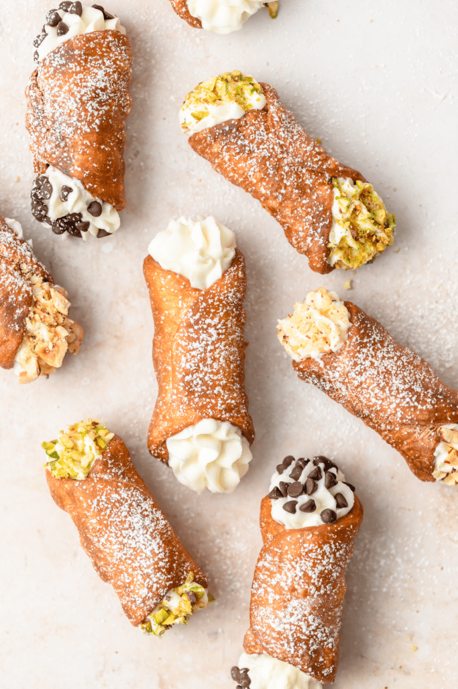

# :cake: Cannoli

| :fork_and_knife_with_plate: Serves | :timer_clock: Total Time |
|:----------------------------------:|:-----------------------: |
| 18 | 1.07 hours |

## :salt: Ingredients

- 2 cups all-purpose flour
- :candy: 2 Tbsp sugar
- :salt: 0.25 tsp salt
- :butter: 3 Tbsp butter
- :egg: 1 large whole egg
- :egg: 1 egg yolk
- :wine_glass: 0.5 cup marsala wine
- :cheese_wedge: 16 oz ricotta
- :candy: 0.5 cup confectioners' sugar
- :icecream: 1 tsp vanilla

## :cooking: Cookware

- 1 food processor
- 1 lightly oiled bowl
- 1 large pot or Dutch oven
- 1 4 inch cookie cutter
- 1 large bowl
- 1 hand mixer

## :pencil: Instructions

### Step 1

### Step 2

comments: true

### Step 3

### Step 4

Add the all-purpose flour, sugar, and salt to the food processor and pulse until just combined. Then add in the cold
butter and pulse until you have small crumbles. You can also make the dough by hand the same way you would make pie
crust.

### Step 5

Add the whole egg, egg yolk, and marsala wine and pulse until the dough comes together into a shaggy ball.

### Step 6

Turn the dough out onto a clean surface and knead for 2 to 4 minutes until you have a smooth ball. Place the dough in a
lightly oiled bowl, cover, and rest for 1 hour.

### Step 7

While the dough is resting, add about 2 inches of vegetable oil to a large pot or Dutch oven over medium heat until it
reaches 350°F.

### Step 8

Roll out the dough as thin as possible (1/8th to 1/16th inch thick) and use a 4 inch cookie cutter to cut into rounds.
For mini cannoli use a 2 inch cookie cutter.

### Step 9

Lightly brush the cannoli forms with vegetable oil and then wrap the cannoli dough around each form. Brush the edge
where the ends meet with egg white and press gently to seal.

### Step 10

Fry the shells at 350°F for about 1 minute on each side until golden brown and crispy. Only fry 4-5 at a time so as not
to crowd the pan.

### Step 11

Use tongs to transfer the cannoli to a paper towel to drain. Immediately remove the form from the cannoli (you can use
the tongs and a paper towel to gently wiggle it off the form, just be careful!).

### Step 12

Let the forms cool fully and repeat the process with the remaining dough circles. Let the cannoli shells cool fully
before filling.

### Step 13

While the cannoli are cooling, make the filling.

### Step 14

Add the strained ricotta, confectioners' sugar, and vanilla to a large bowl. Using a hand mixer, whip the ricotta until
it's fully combined and smooth. If desired, fold in chopped nuts or chocolate chips!

### Step 15

When ready to use transfer to a piping bag, snip the tip off and fill the shells. Then press on desired toppings!

## :link: Source

- <https://www.barleyandsage.com/homemade-cannoli/>
