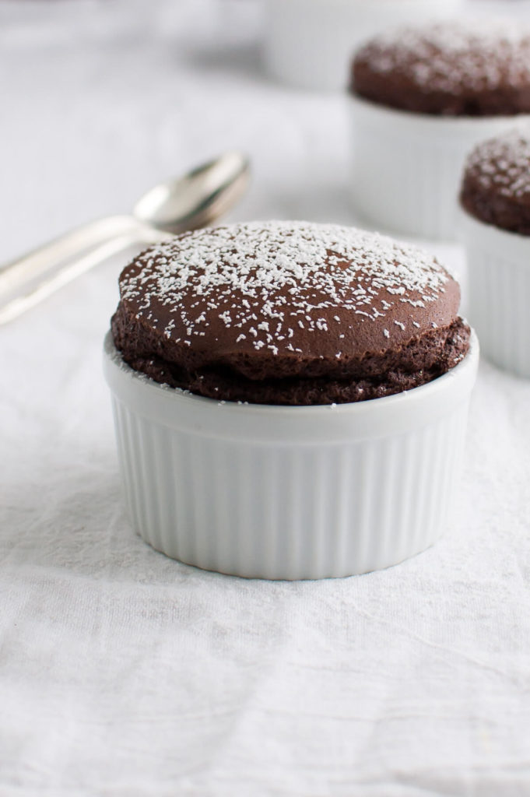

# :custard: Chocolate Soufflé

| :fork_and_knife_with_plate: Serves | :timer_clock: Total Time |
|:----------------------------------:|:-----------------------: |
| 3 to 4 | 40 minutes |

## :salt: Ingredients

- :chocolate_bar: 6 oz (170 g) semisweet or bittersweet chocolate
- :butter: 6 Tbsp (85 g) unsalted butter
- :tumbler_glass: 2 Tbsp rum, coffee, or water
- :egg: 3 large egg yolks
- :egg: 4 large egg whites
- :rice: 0.25 tsp cream of tartar
- :candy: 0.25 cups (50 g) sugar
- :candy: some confectioners' sugar

## :cooking: Cookware

- 1 7-inch or 1/2-quart soufflé mold
- 1 skillet
- 1 large rubber spatula

## :pencil: Instructions

### Step 1

Unlike most chocolate soufflés, this is made without milk or starch. It is light yet moist, with an exceptional
chocolate taste.

### Step 2

Position a rack in the lower third of the oven. Preheat the oven to 375°F. Prepare a 7-inch or 1/2-quart soufflé mold.

### Step 3

Combine in a heatproof bowl chopped semisweet or bittersweet chocolate unsalted butter and rum, coffee, or water.

### Step 4

Set the bowl in a skillet of hot, but not simmering, water and stir until the mixture is smooth. Let cool for 10
minutes, then whisk in egg yolks.

### Step 5

Beat in a large bowl on medium speed until foamy 4 large egg whites, at room temperature

### Step 6

Add and beat on high speed until soft peaks form 1/4 teaspoon cream of tartar

### Step 7

Gradually beat in 1/4 cup sugar.

### Step 8

Beat until the peaks are stiff but not dry. Using a large rubber spatula, stir one-third of the egg whites into the
chocolate mixture, then fold in the remaining whites. Pour the batter into the prepared soufflé mold, tap the mold
to remove air bubbles, and smooth the top. Run a finger around the lip to remove a little bit of the batter. (The
soufflé can be set aside at room temperature, covered with an inverted bowl, for up to 1 hour; or cover with
plastic wrap and refrigerate for up to 24 hours before baking.)

### Step 9

Bake until the soufflé is risen and set, 25 to 30 minutes. Dust with confectioners' sugar. Serve at once.

## :link: Source

- Joy of Cooking
