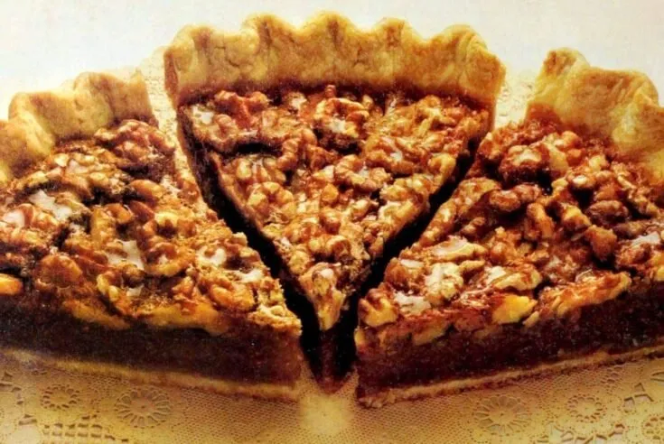

# :pie: Classic Walnut Pie

{ loading=lazy }

| :fork_and_knife_with_plate: Serves | :timer_clock: Total Time |
|:----------------------------------:|:-----------------------: |
| 8 | 60 minutes |

## :salt: Ingredients

- :egg: 3 eggs
- :candy: 1 cup (156 g) sugar
- :bread: 2 Tbsp (12 g) flour
- :candy: 1 cup (312 g) light Karo corn syrup
- :butter: 2 Tbsp butter
- :flower_playing_cards: 1 tsp vanilla
- :bread: 1 unbaked pie shell
- :chestnut: 1.5 cups (192 g) walnuts

## :pencil: Instructions

### Step 1

Preheat oven to 400°F.

### Step 2

Combine eggs, lightly beaten, sugar, flour, light Karo corn syrup, butter, melted, and vanilla; blend well.

### Step 3

Pour into unbaked pie shell.

### Step 4

Arrange walnuts on top (or blend into mixture).

### Step 5

Bake in lower third of oven at 400°F for 15 minutes. Reduce oven temperature to 350°F and bake for additional 35 to 45
minutes.
