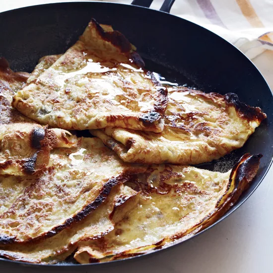

# :pancakes: Crêpes Suzette

| :fork_and_knife_with_plate: Serves | :timer_clock: Total Time |
|:----------------------------------:|:-----------------------: |
| 12 | 45 minutes |

## :salt: Ingredients - Crêpes

- :egg: 2 large eggs
- :ear_of_rice: 0.75 cup all-purpose flour
- :glass_of_milk: 0.5 cup milk
- :salt: 0.13 tsp salt
- :candy: 0.5 tsp sugar
- :ice_cube: 0.33 cup cold water
- :oil_drum: 1 Tbsp canola oil
- :butter: 1 Tbsp butter

## :salt: Ingredients - Orange Butter

- :butter: 6 Tbsp butter
- :candy: 6 Tbsp sugar
- :orange_circle: 1 Tbsp orange zest
- :orange_circle: 0.33 cup orange juice
- :tumber_glass: 0.25 cup Grand Marnier
- :tumber_glass: 2 Tbsp cognac

## :cooking: Cookware

- 1 medium bowl
- 1 6-inch crêpe pan or nonstick skillet
- 1 mini food processor
- 1 baking sheet
- 1 long spatula
- 1 heatproof platter
- 1 small saucepan

## :pencil: Instructions

### Step 1

In a medium bowl, whisk together the eggs, all-purpose flour, milk, salt and sugar until smooth; the batter will be
thick. Whisk in the cold water, canola oil and melted butter.

### Step 2

Heat a 6-inch crêpe pan or nonstick skillet and rub with a little butter. Add 2 tablespoons of the batter and tilt the
skillet to distribute the batter evenly, pouring any excess batter back into the bowl. Cook over moderately high heat
until the edges of the crêpe curl up and start to brown, 45 seconds. Flip the crêpe and cook for 10 seconds longer,
until a few brown spots appear on the bottom. Tap the crêpe out onto a baking sheet. Repeat with the remaining batter
to make 12 crêpes, buttering the skillet a few times as necessary.

### Step 3

In a mini food processor, blend the 6 tablespoons of butter with 1/4 cup of the sugar and the orange zest. With the
machine on, gradually add the orange juice until incorporated.

### Step 4

Preheat the broiler. Butter a large rimmed baking sheet and sprinkle lightly with sugar. Place 2 rounded teaspoons of
the orange butter in the center of each crêpe. Fold the crêpes in half and in half again to form triangles; arrange on
the prepared baking sheet, pointing them in the same direction and overlapping slightly. Sprinkle with the remaining 2
tablespoons of sugar and broil on the middle shelf of the oven until they begin to caramelize, about 2 minutes. Using a
long spatula, transfer the crêpes to a heatproof platter.

### Step 5

Meanwhile, in a small saucepan, heat the Grand Marnier and cognac. Ignite carefully with a long-handled match and pour
the flaming mixture over the crêpes. Tilt the platter and, with a spoon, carefully baste the crêpes until the flames
subside. Serve right away.

## :link: Source

- <https://www.foodandwine.com/recipes/crepes-suzette>
