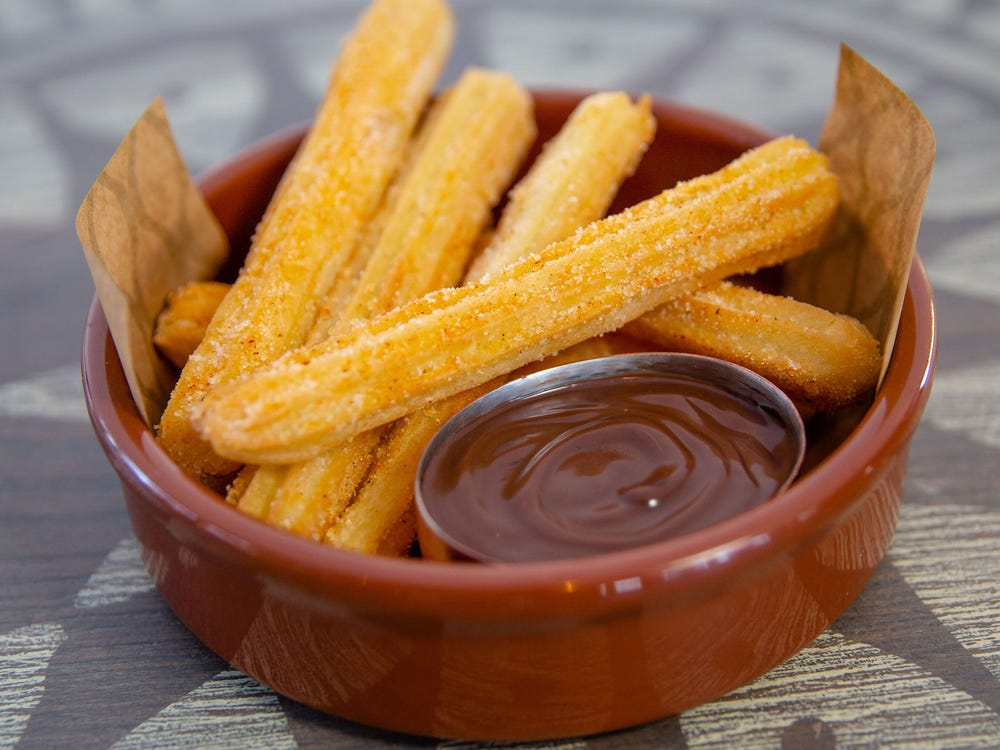

# :pretzel: Disney's Churros

{ loading=lazy }

| :timer_clock: Total Time |
|:-----------------------: |
| 7 minutes |

## :salt: Ingredients

- :droplet: 1 cup water
- :butter: 8 Tbsp butter
- :salt: 0.25 tsp salt
- :custard: 0.25 tsp cinnamon
- :ear_of_rice: 1.25 cups flour
- :egg: 3 eggs
- :carrot: 1.5 cups vegetable oil
- :candy: 0.5 cup sugar
- :custard: 0.5 tsp cinnamon
- :chocolate_bar: some dipping sauce

## :cooking: Cookware

- 1 1.5 quart saucepan
- 1 medium skillet
- 1 piping bag
- 1 large star tip
- 1 saucepan
- 1 knife
- 1 slotted spoon
- 1 medium bowl
- 1 serving plate

## :pencil: Instructions

### Step 1

Combine water, butter, salt, and cinnamon in a 1.5 quart saucepan over medium heat. Bring pot to rolling boil.

### Step 2

Reduce heat to low.

### Step 3

Add flour and stir vigorously until mix forms a ball. Remove from heat and let rest for 5 to 7 minutes.

### Step 4

Add eggs one at a time, and stir until combined. Set aside.

### Step 5

Heat vegetable oil in medium skillet or 1-quart saucepan over medium-high heat or until temperature reaches 350°F.

### Step 6

Spoon dough into piping bag fitted with large star tip. Pipe 1-inch strip of dough over saucepan, cut with knife, and
drop into hot oil. Repeat until churro fills saucepan with room to fry.

### Step 7

Fry churro until golden brown. Remove with slotted spoon or mesh spider strainer.

### Step 8

Drain churros on paper towel.

### Step 9

Mix sugar and 1/2 tsp cinnamon in medium bowl. Toss in churros until coated. Place on serving plate and serve with
favorite dipping sauce.

## :link: Source

- <https://www.disneyfoodblog.com/2020/04/05/disney-recipe-make-disneys-churros-at-home-with-this-recipe/>
