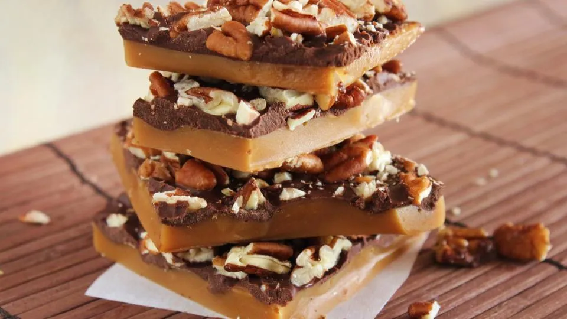

# :candy: English Toffee

{ loading=lazy }

| :fork_and_knife_with_plate: Serves | :timer_clock: Total Time |
|:----------------------------------:|:-----------------------: |
| 1.5 lbs | 28 minutes |

## :salt: Ingredients

- :candy: 1.75 cups (273 g) sugar
- :glass_of_milk: 1 cup (227 g) heavy cream
- :butter: 1 stick unsalted butter
- :glass_of_milk: 0.13 tsp (1 g) cream of tartar
- :flower_playing_cards: 2 tsp vanilla
- :chocolate_bar: 1 Tbsp (11 g) dark rum (alternative)
- :chestnut: 4 oz (70 g) bittersweet, semi-sweet, or milk chocolate
- :chestnut: 0.5 cup (43 g) almonds

## :cooking: Cookware

- 1 13 x 9 inch pan
- :page_facing_up: 1 silicone liner or heavy-duty aluminum foil
- :shallow_pan_of_food: 1 large heavy saucepan
- :paintbrush: 1 pastry brush
- :spoon: 1 wooden spoon
- :spoon: 1 offset spatula
- :page_facing_up: 1 wax paper

## :pencil: Instructions

### Step 1

Line a 13 x 9 inch pan with a silicone liner or heavy-duty aluminum foil, leaving a 2 inch overhang of foil at the two
narrow ends of the pan. Coat the foil with nonstick spray.

### Step 2

Combine in a large heavy saucepan sugar, heavy cream, unsalted butter, and cream of tartar.

### Step 3

Stir over low heat until the sugar is dissolved. Wash down the sides of the pan with a pastry brush dipped in warm
water. Bring to a boil and boil for 3 minutes. Place a warmed candy thermometer in a pan and cook, stirring frequently,
to about 280°F, the soft-crack stage. The syrup will be light-colored and thick.

### Step 4

Remove from the heat and stir with a wooden spoon vanilla or dark rum (alternative).

### Step 5

Pour the candy into the prepared pan and cool 3 minutes.

### Step 6

Sprinkle the hot toffee with finely chopped or grated bittersweet, semi-sweet, or milk chocolate.

### Step 7

Let stand for 1 to 2 minutes, then spread the chocolate evenly across the toffee with a small offset spatula.

### Step 8

Sprinkle on top finely chopped toasted almonds.

### Step 9

Refrigerate the toffee for 20 minutes to set the chocolate. Break the toffee into pieces. Store between layers of wax
paper in an airtight container at room temperature for up to 1 month.

## :link: Source

- Joy of Cooking
