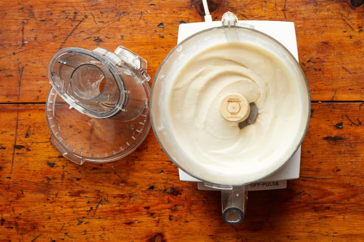

# :ice_cream: Ice Cream

| :fork_and_knife_with_plate: Serves | :timer_clock: Total Time |
|:----------------------------------:|:-----------------------: |
| 1.5 pints | 4.08 hours |

## :salt: Ingredients

- :glass_of_milk: 2 cups (454 g) heavy cream
- :glass_of_milk: 1 cup (227 g) whole milk
- :candy: 0.67 (132 g) cup granulated sugar
- :salt: 0.13 tsp salt
- :egg: 6 large egg yolks

## :cooking: Cookware

- 1 small pot
- 1 bowl
- 1 fine-mesh sieve
- 1 bowl
- 1 rimmed baking sheet
- 1 zip-top bag
- 1 food processor

## :pencil: Instructions

### Step 1

In a small pot, simmer heavy cream, whole milk, granulated sugar, and salt until sugar completely dissolves, about 5
minutes. Remove pot from heat.

### Step 2

In a separate bowl, whisk egg yolks. Whisking constantly, slowly whisk about a third of the hot cream into the yolks,
then whisk the mixture back into the pot with the cream.

### Step 3

Return pot to medium-low heat and gently cook until mixture is thick enough to coat the back of a spoon (about 170°F on
an instant-read thermometer).

### Step 4

Strain through a fine-mesh sieve into a bowl. Cool mixture to room temperature by spreading into a rimmed baking sheet.
Place in a zip-top bag and chill at least 4 hours or overnight.

### Step 5

After freezing, you’ll have a sheet of frozen ice cream base that you can break or cut into chunks to fit inside your
food processor. Then you pulse the frozen base in a food processor before freezing again overnight.

## :link: Source

- The New York Times
