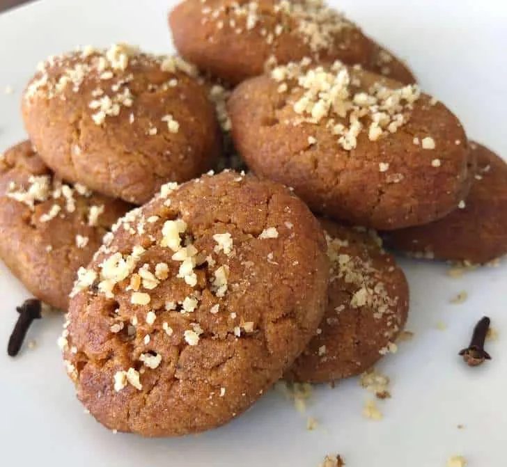

# :cookie: Melomakarona

{ loading=lazy }

| :timer_clock: Total Time |
|:-----------------------: |
| 1.48 hours |

## :salt: Ingredients

=== "Dough"

    - :bread: 6.75 cups (621 g) flour
    - :chestnut: 1.5 tsp baking powder
    - :chestnut: 1 tsp (4 g) cinnamon
    - :salt: 1 tsp salt
    - :chestnut: 0.5 tsp baking soda
    - :chestnut: 0.25 tsp cloves
    - :butter: 1 stick butter
    - :candy: 1 cup (156 g) sugar
    - :egg: 2 eggs
    - :olive: 1.5 cup (300 g) olive oil
    - :tangerine: 1 cup (224 g) orange juice
    - :tangerine: 2 tsp (4 g) orange zest

=== "Honey Syrup"

    - :tangerine: 3 strips orange peel
    - :candy: 1.5 cups (234 g) sugar
    - :honey_pot: 1.5 cups honey
    - :droplet: 1.5 cups (340 g) water

=== "Walnut Topping"

    - :beans: 8 oz (113 g) finely chopped walnuts
    - :chestnut: 1 tsp (4 g) cinnamon
    - :chestnut: 0.13 tsp cloves

## :cooking: Cookware

- :gear: 1 stand mixer
- 1 tall sauté pan
- 1 slotted spoon
- :page_facing_up: 1 parchment
- :wastebasket: 1 wire rack

## :pencil: Instructions - Dough

### Step 1

To make dough, whisk together flour, 1.5 tsp baking powder, 1 tsp cinnamon, 1 tsp salt, 1/2 tsp baking soda, and 1/4 tsp
cloves.

### Step 2

In a stand mixer, cream butter and 1 cup sugar for 3 minutes. Reduce speed to low, then add eggs, olive oil, orange
juice, and orange zest.

### Step 3

Refrigerate for 1 hour or overnight.

## :pencil: Instructions - Honey Syrup

### Step 4

To make honey syrup, stir together orange peel, 1.5 cups sugar, honey, and water in a tall sauté pan.

### Step 5

Heat to boiling and allow to boil for 1 minute. Remove from heat and let syrup cool completely.

## :pencil: Instructions - Walnut Topping

### Step 6

To make the walnut topping, stir together finely chipped walnuts, 1 tsp cinnamon, and 1/8 tsp cloves.

### Step 7

To bake cookies, preheat the oven to 350°F. Scoop 1.5 Tbsp of dough and roll and press into an oval shape. Prick tops
of cookies with a fork 4 to 5 times so that tiny marks are visible.

### Step 8

Return remaining dough to refrigerator between batches.

### Step 9

Bake cookies for 20 to 25 minutes. Line a cooling rack with parchment paper.

### Step 10

In batches, transfer hot cookies to cool honey syrup. Soak for 30 seconds, turning halfway through.

### Step 11

Using a slotted spoon, transfer cookies to parchment-lined wire rack. Immediately sprinkle with walnut topping.

### Step 12

When completely cooled, transfer cookies to airtight containers. With parchment paper between layers. Cookies will last
up to 2 weeks.

## :link: Source

- Recipe Box
