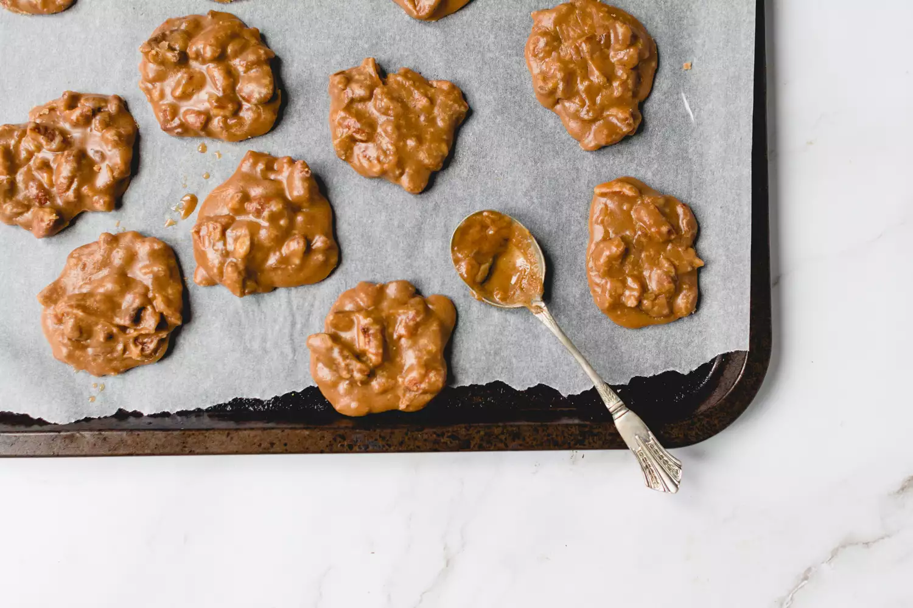

# :chestnut: New Orleans Pralines

{ loading=lazy }

| :timer_clock: Total Time |
|:-----------------------: |
| 31 minutes |

## :salt: Ingredients

- :candy: 1 cup (198 g) granulated sugar
- :maple_leaf: 1 cup (213 g) brown sugar
- :glass_of_milk: 0.5 cup [evaporated milk][1]
- :butter: 4 Tbsp (57 g) unsalted butter
- :icecream: 2 tsp vanilla extract
- :chestnut: 1.5 (149 g) cup toasted pecans
- :hotsprings: 0.25 cup (57 g) boiling hot water

## :cooking: Cookware

- 1 baking sheet
- 1 aluminum foil
- 1 medium saucepan
- 1 candy thermometer
- 1 wooden spoon

## :pencil: Instructions

### Step 1

Gather the ingredients.

### Step 2

Prepare a baking sheet by lining it with aluminum foil and spraying the foil with nonstick cooking spray. Alternatively,
use a silicone mat on top of the baking sheet.

### Step 3

In a medium saucepan over medium heat, combine the white granulated sugar, brown sugar, and evaporated milk.

### Step 4

Stir until the sugar dissolves. Once all is well mixed, insert a candy thermometer. Cook the candy, stirring
occasionally, until the thermometer reads 240°F.

### Step 5

Once the proper temperature is reached, remove the pan from the heat and drop the cubes of unsalted butter on top,
without stirring. Allow the sugar mixture to sit for 1 minute.

### Step 6

Add the vanilla extract and toasted pecans.

### Step 7

Begin to stir smoothly and constantly with a wooden spoon; the candy will begin to thicken and appear lighter in color.
Continue to stir until the candy starts to hold its shape. It should still be easy to stir, but don't overdo it, as
pralines quickly go from fluid to rock-solid.

### Step 8

Once the confection has a lighter opaque-brown color and is holding its shape, work quickly and drop small spoonfuls of
the candy onto the prepared baking sheet. Because the pralines will start to set in the saucepan, you need to spoon out
the candy as fast as you safely can. If the candy stiffens before you’re done scooping, add a spoonful of boiling hot
water and stir until it loosens, then continue scooping until you have formed all the pralines.

### Step 9

Allow the candy to fully set at room temperature; it should take about 30 minutes for the pralines to harden. Store the
pralines in an airtight container at room temperature. Enjoy.

## :link: Source

- <https://www.thespruceeats.com/new-orleans-pralines-521172>

[1]: <../ingredients/evaporated-milk.md>
