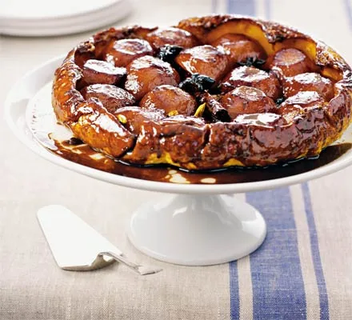

# :pear: Pear Tarte Tatin

| :timer_clock: Total Time |
|:-----------------------: |
| 60 minutes |

## :salt: Ingredients

- :pear: 8 pears
- :candy: 100 g sugar
- :butter: 100 g butter
- :star: 2 star anise
- :olive: 3 pods cardamom
- 1 large cinnamon stick
- :tumbler_glass: 2 Tbsp brandy
- 500 g all-butter [puff pastry][1]

## :cooking: Cookware

- 1 ovenproof frying pan
- 1 plate

## :pencil: Instructions

### Step 1

Core the pears, then peel as neatly as possible and halve. If you like, they can be prepared up to a day ahead and kept
in the fridge, uncovered, so that they dry out.

### Step 2

Tip the sugar, butter, star anise, cardamom and cinnamon stick into an ovenproof frying pan, about 20cm wide, and place
over a high heat until bubbling. Shake the pan and stir the buttery sauce until it separates and the sugar caramelizes
to a toffee color.

### Step 3

Lay the pears in the pan, then cook in the sauce for 10 to 12 minutes, tossing occasionally, until completely
caramelized. Don’t worry about them burning – they won’t – but you want to caramelize them as much as possible.
Splash in the brandy and let it flambé, then set the pears aside.

### Step 4

Heat oven to 200°C / fan 180°C (350°F) / gas 6. Roll the all-butter puff pastry out to the thickness of 3 mm (1/8
in). Using a plate slightly larger than the top of the pan, cut out a circle, then press the edges of the circle of
pastry to thin them out.

### Step 5

When the pears have cooled slightly, arrange them in the pan, cut side up, in a floral shape, with the pears around the
edge pointing inwards. Rest the cinnamon stick on the top in the center, with the cardamom pods scattered around.

### Step 6

Drape the pastry over the pears, then tuck the edges down the pan sides and under the fruit (see Gordon’s guide).
Pierce the pastry a few times, then bake for 15 minutes. If a lot of juice bubbles up the side of the pan, pour it off
at this stage (see guide). Reduce oven to 180°C / fan 160°C (325°F) / gas 4 and bake for 15 minutes more until the
pastry is golden. Leave the tart to stand for 10 minutes, then invert it carefully onto a serving dish.

## :link: Source

- <https://www.bbcgoodfood.com/recipes/pear-tarte-tatin>

[1]: <../ingredients/pastry-dough/puff-pastry.md>
