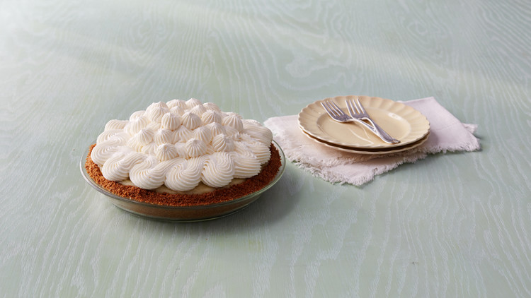

# :banana: Banana Cream Pie

{ loading=lazy }

| :fork_and_knife_with_plate: Serves | :timer_clock: Total Time |
|:----------------------------------:|:-----------------------: |
| 1 9 inch pie | 8.08 hours |

## :salt: Ingredients

- :icecream: 4 cups heavy cream
- :glass_of_milk: 1.5 cups whole milk
- :candy: 1.5 cups granulated sugar
- :icecream: 1 vanilla bean
- :egg: 3 large egg yolks
- :egg: 2 large eggs
- :corn: 0.5 cup cornstarch
- :rice_cracker: 1 graham cracker crust
- :banana: 3 lbs (6 to 7) banana
- :candy: 2 tsp granulated sugar
- :icecream: 0.5 tsp vanilla

## :cooking: Cookware

- 1 large heavy-bottomed saucepan
- 1 large wooden spoon
- 1 fine-mesh strainer
- 1 bowl
- 1 plastic wrap
- 1 large spoon or rubber spatula
- 1 pastry bag

## :pencil: Instructions

### Step 1

Combine 2 cups heavy cream, the whole milk, 1/2 cup granulated sugar, and vanilla bean and seeds in a large
heavy-bottomed saucepan over medium heat. Bring to a gentle boil, whisking to dissolve sugar. Remove from heat.

### Step 2

Combine egg yolks, eggs, cornstarch, and 1 cup sugar in a medium bowl; whisk until pale yellow in color. Set aside.

### Step 3

Whisk 1 cup hot cream mixture into egg yolk mixture. Gradually add egg mixture to hot cream mixture, whisking
constantly. Bring to a simmer, stirring constantly with a large wooden spoon to cook out cornstarch and thicken mixture,
about 5 minutes. (The mixture may separate slightly; if it does, remove from heat and beat with an electric mixer until
thick and smooth.) Strain through a fine-mesh strainer into a clean bowl. Cover with plastic wrap, pressing down against
surface to prevent a skin from forming. Chill in refrigerator about 4 hours.

### Step 4

To assemble, spread 1/2 cup custard over bottom of prepared graham cracker crust, smoothing with the back of a large
spoon or rubber spatula. Arrange enough (6 to 7) banana slices (not quite one-third of them) in a tight, tiled pattern
over custard, pressing down with hands to pack them firmly. Repeat to build a second layer, using 3/4 cup custard and
enough bananas to cover, smoothing down layer evenly. For third layer, spread 3/4 cup custard over bananas and top with
remaining bananas, starting 1 inch from outer edge and working toward center. Spread 1 cup custard evenly over bananas
to prevent discoloration. Cover with plastic wrap and chill at least 4 hours or overnight.

### Step 5

Whip remaining 2 cups heavy cream in a medium bowl until soft peaks form. Add remaining 2 teaspoons granulated sugar and
vanilla extract and continue to whip until stiff peaks form.

### Step 6

Remove pie from refrigerator. Fill a pastry bag with whipped cream and pipe onto pie. (Alternately, spread whipped cream
evenly over pie.) With a sharp knife dipped in hot water, cut pie into 10 equal slices. Transfer slices to dessert
plates. Serve.

## :link: Source

- <https://www.marthastewart.com/1105366/marthas-banana-cream-pie>
