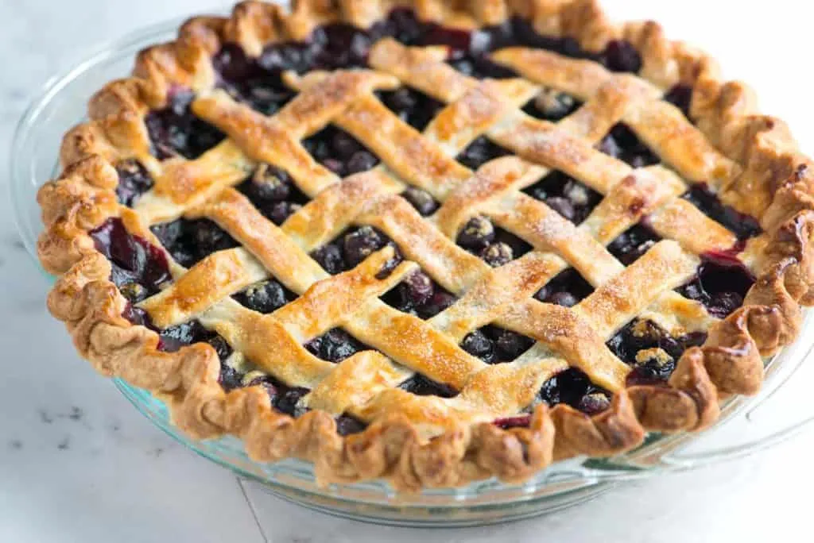

# :pie: Blueberry Pie

{ loading=lazy }

| :timer_clock: Total Time |
|:-----------------------: |
| 1.22 hours |

## :salt: Ingredients

- :butter: 8 Tbsp (92 g) vegetable shortening
- :butter: 12 Tbsp (170 g) unsalted butter
- :bread: 2.5 cups (230 g) flour
- :candy: 2 Tbsp (20 g) sugar
- :salt: 1 tsp salt
- :tangerine: 0.25 cup vodka
- :baby_bottle: 0.25 cup (57 g) ice water
- 3 cups (426 g) berries
- :apple: 1 granny smith apple
- 3 cups (426 g) berries
- :butter: 2 Tbsp (28 g) unsalted butter
- :candy: 0.75 cup (117 g) sugar
- :coffee: 2 Tbsp (18 g) instant tapioca
- :tangerine: 2 tsp (9 g) lemon zest
- :tangerine: 2 tsp (9 g) lemon juice
- :salt: some salt

## :cooking: Cookware

- 1 9" pie plate
- 1 medium saucepan
- 1 potato masher
- 1 towel

## :pencil: Instructions

### Step 1

For crust, chill and cut vegetable shortening into 4 pieces. Chill 12 Tbsp unsalted butter and cut into 1/4" pieces.

### Step 2

Combine flour, sugar, salt, butter, vegetable shortening, chilled vodka, and ice water.

### Step 3

Roll 1 disk of dough into a 12" circle on a lightly flowered counter. Roll into a 9" pie plate.

### Step 4

Place 3 cups of berries in a medium saucepan and set over medium heat.

### Step 5

Mash with potato masher until half of berries have broken down.

### Step 6

Heat for 8 minutes, until mixture is thickened and reduced to 1.5 cups.

### Step 7

Place shredded granny smith apple in towel and squeeze out juice.

### Step 8

Mix apple, cooked berries, raw berries, 2 Tbsp unsalted butter, sugar, instant tapioca, lemon zest, lemon juice, and
pinch of salt.

### Step 9

Pour into pie plate and cover with second crust or make lattice top.

### Step 10

Bake on lowest rack at 400°F for 25 minutes, then reduce to 350°F and bake 30 to 40 minutes more.

## :link: Source

- Recipe Box
