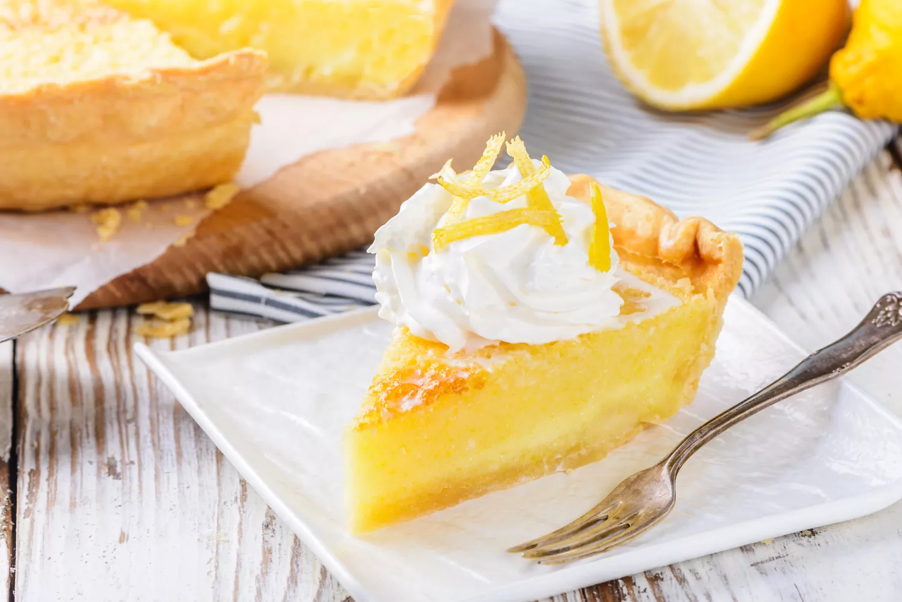

# :pie: [buttermilk](../../ingredients/buttermilk.md) Chess Pie

{ loading=lazy }

| :timer_clock: Total Time |
|:-----------------------: |
| 40 minutes |

## :salt: Ingredients

- [Chess Pie][2]
- :candy: 0.67 cup (133 g) white sugar
- 0.67 cup [buttermilk][1]
- :apple: 0.5 cup (56 g) pecans or walnuts (optional)
- :leafy_green: 0.5 cup (85 g) raisins (optional)

## :cooking: Cookware

## :pencil: Instructions

### Step 1

Prepare [Chess Pie][2].

### Step 2

Add 2/3 cup additional white sugar and us 2/3 cup [buttermilk][1] instead of cream or milk.

### Step 3

Stir into the filling chopped pecans or walnuts (optional) and chopped raisins (optional).

### Step 4

Bake until the center is set when nudged, 35 to 40 minutes.

## :link: Source

- Joy of Cooking

[1]: <../../ingredients/buttermilk.md>
[2]: <./chess-pie.md>
