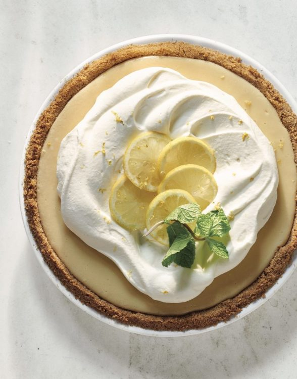

# :pie: Lemon Pie

{ loading=lazy }

| :timer_clock: Total Time |
|:-----------------------: |
| 1.37 hours |

## :salt: Ingredients - Crust

- :cookie: 1.5 cups crushed [graham crackers][1]
- :candy: 0.33 cup sugar
- :butter: 6 Tbsps melted salted butter

## :salt: Ingredients - Filling

- :oil_drum: some vegetable oil
- :glass_of_milk: 3 cups [sweetened condensed milk][2]
- :egg: 3 egg yolks
- :lemon: 0.66 cup lemon juice
- :salt: some salt

## :salt: Ingredients - Whipped Cream Topping

- :icecream: 1 cup heavy cream
- :candy: 0.33 cup sugar
- :icecream: 1 tsp vanilla
- :lemon: some fresh lemon slices
- :lemon: some lemon zest
- :herb: some mint sprigs

## :cooking: Cookware

- 1 9-inch pie plate
- 1 large bowl
- 1 prepared pie plate
- 1 stand mixer
- 1 medium bowl
- 1 handheld electric mixer

## :pencil: Instructions - Pie

### Step 1

Preheat the oven to 350°F. Lightly spray a 9-inch pie plate with vegetable oil.

### Step 2

In a large bowl, combine the crushed graham crackers and 1∕3 cup of the sugar and stir to blend. Stir in the melted
salted butter until well blended. Press the cracker mixture onto the bottom and up the sides of the prepared pie
plate. Bake until firm, about 8 minutes.

### Step 3

Meanwhile, in a stand mixer fitted with the paddle attachment (or in a large bowl with a handheld electric mixer), beat
the condensed milk, egg yolks, lemon juice, and salt on medium speed for 4 minutes.

### Step 4

Pour the mixture into the baked pie crust. Return to the oven and bake until the center is set when the pan is gently
nudged, about 10 minutes.

### Step 5

Cool the pie on a rack for 30 minutes. Place in the refrigerator until set, at least 1 hour and up to 3 days.

## :pencil: Instructions - Whipped Cream

### Step 6

In a medium bowl, with a handheld electric mixer, beat the heavy cream, sugar, and vanilla on high speed until fluffy
and the cream holds a soft peak when you pull the beater out of the bowl.

### Step 7

Spread the cream on the cooled pie. Garnish with fresh lemon slices, a sprinkle of lemon zest, and mint sprigs.

### :link: Source

- <https://magnolia.com/blog/article/12252/lemon-pie-recipe/>

[1]: <../../ingredients/graham-crackers.md>
[2]: <../../ingredients/sweetened-condensed-milk.md>
