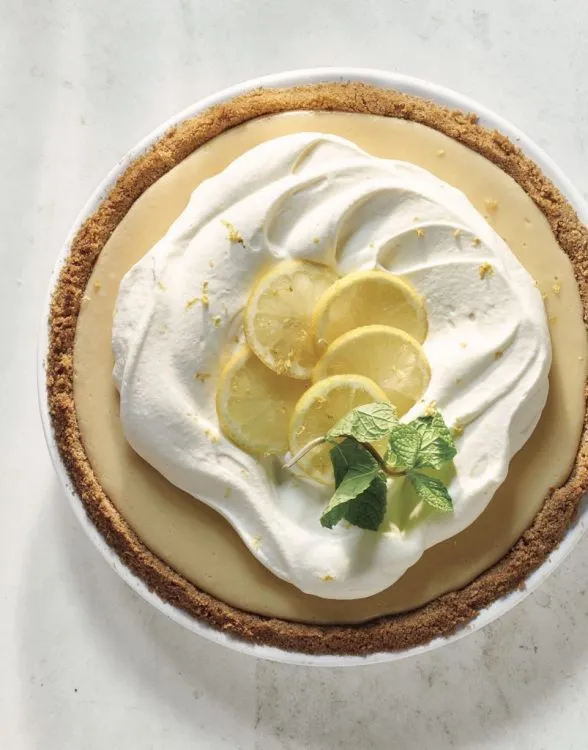

# :pie: Lemon Pie

{ loading=lazy }

| :timer_clock: Total Time |
|:-----------------------: |
| 1.37 hours |

## :salt: Ingredients

=== "Crust"

    - :hot_pepper: 1.5 cups (384 g) crushed [graham crackers][1]
    - :candy: 0.33 cup (65 g) granulated sugar
    - :butter: 6 Tbsps melted salted butter
    - :leafy_green: 1/2 lemon zest (optional)

=== "Filling"

    - :olive: some vegetable oil
    - :glass_of_milk: 3 cups (864 g) [sweetened condensed milk][2]
    - :baby_bottle: 3 egg yolks
    - :tangerine: 0.66 cup (148 g) lemon juice
    - :salt: some salt

=== "Whipped Cream Topping"

    - :glass_of_milk: 1 cup (227 g) heavy cream
    - :candy: 2 Tbsp (20 g) sugar
    - :flower_playing_cards: 1 tsp vanilla
    - :apple: some fresh lemon slices
    - :tangerine: some lemon zest
    - :shamrock: some mint sprigs
    - :apple: some [candied lemon peel][3]

## :cooking: Cookware

- 1 9-inch pie plate
- 1 large bowl
- 1 prepared pie plate
- 1 stand mixer
- 1 medium bowl
- 1 handheld electric mixer

## :pencil: Instructions - Pie

### Step 1

Preheat the oven to 350°F. Lightly spray a 9-inch pie plate with vegetable oil.

### Step 2

In a large bowl, combine the crushed graham crackers, 1∕3 cup of the granulated sugar, and lemon zest (optional) and
stir to blend. Stir in the melted salted butter until well blended. Press the cracker mixture onto the bottom and up
the sides of the prepared pie plate. Bake until firm, about 8 minutes.

### Step 3

Meanwhile, in a stand mixer fitted with the paddle attachment (or in a large bowl with a handheld electric mixer), beat
the condensed milk, egg yolks, lemon juice, and salt on medium speed for 4 minutes.

### Step 4

Pour the mixture into the baked pie crust. Return to the oven and bake until the center is set when the pan is gently
nudged, about 10 minutes.

### Step 5

Cool the pie on a rack for 30 minutes. Place in the refrigerator until set, at least 1 hour and up to 3 days.

## :pencil: Instructions - Whipped Cream

### Step 6

In a medium bowl, with a handheld electric mixer, beat the heavy cream, granulated sugar, and vanilla on high speed
until fluffy and the cream holds a soft peak when you pull the beater out of the bowl.

### Step 7

Spread the cream on the cooled pie. Garnish with fresh lemon slices, a sprinkle of lemon zest,
[candied lemon peel][3], and mint sprigs.

### :link: Source

- [Magnolia](https://web.archive.org/web/20230104034648/https://magnolia.com/blog/article/12252/lemon-pie-recipe/)

[1]: <../../ingredients/graham-crackers.md>
[2]: <../../ingredients/sweetened-condensed-milk.md>
[3]: <../../ingredients/candied-orange-peel.md>
