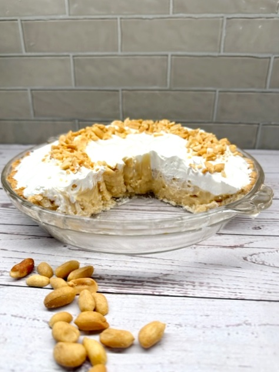

# :peanuts: Peanut Butter Cream Pie

| :timer_clock: Total Time |
|:-----------------------: |
| 20 minutes |

## :salt: Ingredients

- :candy: 1 cup (198 g) granulated sugar
- :corn: 0.5 cup (58 g) cornstarch
- :salt: 0.25 tsp salt
- :glass_of_milk: 3 cups (681 g) whole milk
- :egg: 3 egg yolks
- :peanuts: 0.5 cup (68 g) [creamy peanut butter][4]
- :icecream: 2 tsp vanilla
- :pie: 1 [pie crust][3]
- :icecream: some whipped topping or homemade [whipped cream][1] (optional)
- :peanuts: some peanuts (optional)
- :chocolate_bar: some [hot fudge sauce][5] or chocolate syrup (optional)

## :cooking: Cookware

- 1 small bowl
- 1 medium saucepan
- 1 waxed paper or plastic film

## :pencil: Instructions

### Step 1

Make a [crème pâtissière][2]. Whisk together the granulated sugar, cornstarch, and salt in a small bowl and set aside.

### Step 2

Put the whole milk and the egg yolks in a medium saucepan, and whisk until smooth.

### Step 3

Turn on the heat to low.

### Step 4

Slowly add the sugar mixture to the milk mixture.

### Step 5

Increase the heat to medium, and whisk constantly until the mixture comes to a boil and thickens to a pudding
consistency.

### Step 6

Remove the pan from heat, and pour the mixture into a bowl.

### Step 7

Press waxed paper or plastic film onto the surface of the pudding immediately.

### Step 8

Cover the pudding and refrigerate until the pudding is completely cool.

### Step 9

Use a hand mixer to whip the chilled pudding until it is creamy, then add the [creamy peanut butter][4] and the
vanilla.

### Step 10

Continue to beat the mixture until evenly blended and creamy.

### Step 11

Pour the filling into a cool prebaked [pie crust][3].

### Step 12

If desired, top with whipped topping or homemade [whipped cream][1] (optional).

### Step 13

Garnish with crushed peanuts (optional) if you like.

### Step 14

Drizzle with hot fudge sauce or chocolate syrup (optional) if desired.

## :link: Source

- <https://yeyfood.com/how-to-make-a-yummy-peanut-butter-cream-pie/>

[1]: <../../ingredients/sweetened-whipped-cream.md>
[2]: <../../custards/crème-pâtissière.md>
[3]: <../../ingredients/pastry-dough/sweet-pastry.md>
[4]: <../../ingredients/peanut-butter.md>
[5]: <../../sauces-and-dressings/hot-fudge-sauce.md>
