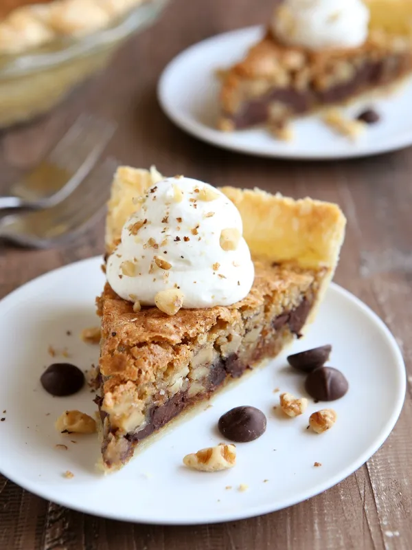

# :pie: Tollhouse Pie

{ loading=lazy }

| :timer_clock: Total Time |
|:-----------------------: |
| 60 minutes |

## :salt: Ingredients

- :egg: 2 eggs
- :bread: 0.5 cup (46 g) flour
- :candy: 0.5 cup (78 g) sugar
- 0.5 cup [brown sugar][1]
- :butter: 1 cup butter
- :chocolate_bar: 1 6 oz pkg chocolate chips
- 1 unbaked [pie shell][2]

## :cooking: Cookware

- 1 large bowl

## :pencil: Instructions

### Step 1

Preheat oven to 325°F. In large bowl, beat eggs until foamy.

### Step 2

Add flour, sugar, and [brown sugar][1],and beat until well-blended.

### Step 3

Mix in melted butter. Stir in chocolate chips and pour into unbaked [pie shell][2].

### Step 4

Bake for 1 hour.

## :link: Source

- Recipe Box

[1]: <../../ingredients/brown-sugar.md>
[2]: <../../ingredients/pastry-dough/sweet-pastry.md>
