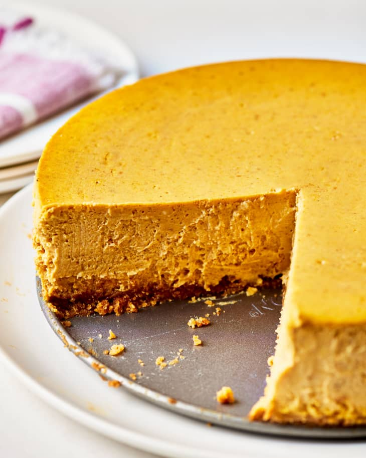

# :pie: Pumpkin Cheesecake

| :fork_and_knife_with_plate: Serves | :timer_clock: Total Time |
|:----------------------------------:|:-----------------------: |
| 10-12 | 54 minutes |

## :salt: Ingredients - Filling

- :pie: 1 [Crumb Crust][1] made with graham crackers
- :pie: 1 Nut Crust made with pecans (alternative)
- :maple_leaf: 0.67 cup brown sugar
- :custard: 0.75 tsp cinnamon
- :chestnut: 0.25 tsp cloves
- :sweet_potato: 0.25 tsp ginger
- :chestnut: 0.13 tsp nutmeg
- :cheese_wedge: 1 lb cream cheese
- :egg: 2 large eggs
- :egg: 2 large egg yolks
- :jack_o_lantern: 1 cup canned or cooked pumpkin

## :salt: Ingredients - Topping

- :rice: 0.5 cup sour cream
- :maple_leaf: 0.33 cup light brown sugar
- :icecream: 1 tsp vanilla

## :cooking: Cookware

- 1 cake pan
- 1 small bowl
- 1 large bowl

## :pencil: Instructions

### Step 1

Prepare and bake in an 8-inch springform or cake pan [Crumb Crust][1] made with graham crackers or Nut Crust made with
pecans(alternative).

### Step 2

Let cool. Have all ingredients at room temperature, about 70°F. Place a loaf pan or cake pan filled with hot water in
the oven to moisten the air. Preheat the oven to 350°F.

### Step 3

Combine in a small bowl: 2/3 cup packed brown sugar, 3/4 teaspoon ground cinnamon, 1/4 teaspoon ground cloves, 1/4
teaspoon ground ginger, and 1/8 teaspoon grated or ground nutmeg.

### Step 4

Beat in a large bowl just until smooth, 30 to 60 seconds cream cheese.

### Step 5

Scrape the sides of the bowl and the beaters well. Gradually add the sugar mixture and beat until smooth and creamy, 1
to 2 minutes. Beat in one at a time until well blended, scraping the sides of the bowl and the beaters after each
addition: 2 large eggs and 2 large egg yolks Add and beat in just until mixed 1 cup canned or cooked pumpkin

### Step 6

Scrape the batter into the crust and smooth the top. Set the pan on a baking sheet. Bake for 30 minutes at 350°F, then
reduce the oven temperature to 325°F and bake until the edges of the cheesecake are puffed but the center still looks
moist and jiggles when the pan is tapped, 10 to 15 minutes more. Meanwhile, to make the topping, whisk together until
well blended: 1/2 cups sour cream , 1/3 cup packed light brown sugar, and 1 teaspoon vanilla

### Step 7

Scrape on top of the hot cake and smooth with a spatula. Return to the oven for 7 minutes. Remove the pan to a rack and
cover the pan and rack with a large inverted bowl or pot so that the cake cools slowly. Let cool completely before
unmolding. Cover and refrigerate for at least 6 hours, preferably 24 hours, before serving.

## :link: Source

- Joy of Cooking

[1]: <../ingredients/crumb-crust.md>
