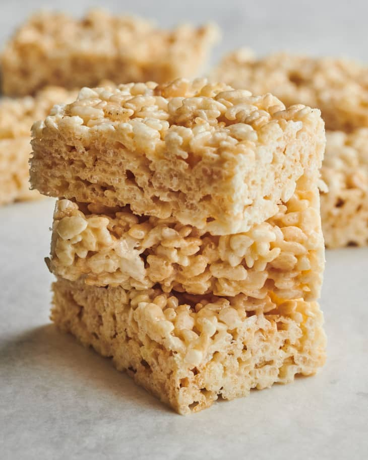

# :bowl_with_spoon: Rice Krispies

| :fork_and_knife_with_plate: Serves | :timer_clock: Total Time |
|:----------------------------------:|:-----------------------: |
| 18 | 30 minutes |

## :salt: Ingredients

- :ear_of_rice: 7 cups Rice Krispies Cereal
- :butter: 6 Tbsp unsalted butter
- :dango: 16 oz marshmallows

## :cooking: Cookware

- 1 9 x 13 inch pan
- 1 large mixing bowl
- 1 medium or large saucepan
- 1 rubber spatula

## :pencil: Instructions

### Step 1

Grease a 9 x 13 inch pan and a large mixing bowl with butter or baking spray.

### Step 2

Pour the  Rice Krispies Cereal into the greased bowl and set it aside.

### Step 3

Begin to melt unsalted butter over low heat in a medium or large saucepan.

### Step 4

Add the marshmallows to the saucepan and stir.

### Step 5

Continue to stir often, until about 75 percent of the marshmallows are melted.

### Step 6

Remove the pan from the heat and continue to stir, smashing the marshmallows using a rubber spatula or the back of a
wooden spoon, until the marshmallows completely melt and become smooth.

!!! note

    We recommend taking the marshmallows off the heat before they are completely melted, so you will not overheat the
    marshmallows. The residual heat from the melted marshmallows will heat the unmelted marshmallows slowly, allowing
    them to melt without getting too hot. When marshmallows are overheated, the sugar crystallizes, turning into hard
    candy. Overheated marshmallows will make your treats hard to bite into.

### Step 7

Pour the marshmallows over the cereal and toss to combine.

!!! note

    We recommend pouring the marshmallows over the cereal instead of adding them to the pan. If the cereal is poured
    into the hot pan, the crisp rice may become soft if it gets too hot. Your treats may taste stale immediately after
    they are made because the cereal will be soft.

### Step 8

Once the cereal is mixed with the melted marshmallows, pour it into a well-buttered 9 x 13 pan.

### Step 9

GENTLY spread it into an even layer. Do not compress the mixture or your treats will be dense and hard.

### Step 10

Allow the treats to cool for at least 30 minutes before cutting into rectangles or squares.

!!! note

    European-style salted butter contains more butterfat than American-style butter adding richness to the treats.
    Salted butter balances out the sweetness.

!!! note

    We recommend using Kraft Jet-Puffed Marshmallows. They have great texture and flavor. We found store-brand
    marshmallows to be stickier. If you use store-brand marshmallows, we recommend adding up to one additional cup of
    Rice Krispies Cereal.

!!! note

    Store your treats in an airtight container at room temperature for up to a week.

!!! note

    Do NOT refrigerate your treats. They will become stale-tasting if stored in the fridge.

!!! note

    You can freeze the treats. Wrap them well, and freeze for up to 3 months. To thaw, bring them to room temperature
    and let them sit, wrapped, for a few hours. Then unwrap and enjoy.

!!! note

    Do NOT overheat your marshmallows. This is key to making soft and chewy Rice Krispie Treats, not hard treats.

!!! note

    Do NOT compact the cereal treat mixture into your pan or you will end up with very dense, hard treats. Gently press
    the mixture into the pan.

## :link: Sources

- <https://howtomakecerealtreats.com/rice-krispie-treats-recipe/>
- <https://www.thekitchn.com/rice-krispies-treats-recipe-reviews-23153075>
