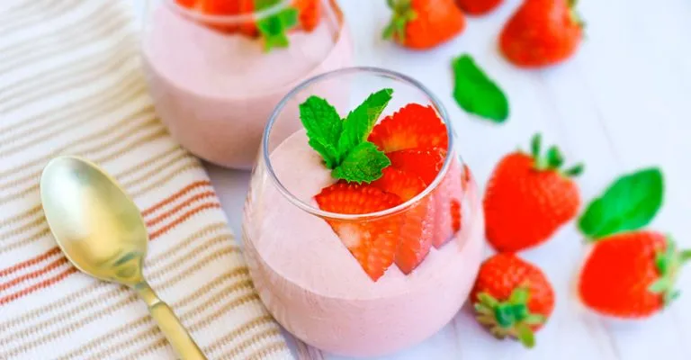

# :strawberry: Strawberry Mousse

{ loading=lazy }

| :fork_and_knife_with_plate: Serves | :timer_clock: Total Time |
|:----------------------------------:|:-----------------------: |
| 3 | 45 minutes |

## :salt: Ingredients

- :cheese_wedge: 1 pkg silken tofu
- :flower_playing_cards: 1 tsp vanilla
- :strawberry: 1 Tbsp (21 g) strawberry preserves
- :strawberry: 1 cup (113 g) frozen strawberries
- :grapes: 4 Medjool dates
- :tangerine: 2 Tbsp (28 g) lemon juice

## :cooking: Cookware

- :gear: 1 blender
- :snowflake: 1 freezer-safe dish

## :pencil: Instructions

### Step 1

In a blender, process 12.3 oz package of organic firm silken tofu, vanilla, strawberry preserves, frozen
strawberries, Medjool dates, and lemon juice until smooth.

### Step 2

Place mixture into a freezer-safe dish and allow to set for 45 minutes.

### Step 3

Scoop and serve. Store any leftovers in the refrigerator.

## :link: Source

- <https://nutritionstudies.org/recipes/dessert/strawberry-mousse/>
