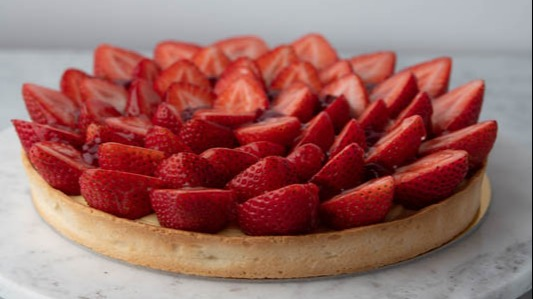

# :strawberry: Strawberry Tart

{ loading=lazy }

| :fork_and_knife_with_plate: Serves | :timer_clock: Total Time |
|:----------------------------------:|:-----------------------: |
| 1 8-inch tart | 30 minutes |

## :salt: Ingredients

- :pie: 1 8-inch [vanilla sable shell][4]
- :strawberry: 150 g [quick strawberry jam][3]
- :egg: 300 g [pastry cream][1]
- :strawberry: 2 lbs fresh strawberries
- :strawberry: 50 g [clear glaze][2]

## :cooking: Cookware

- 1 cake stand or cardboard cake circle
- 1 plastic piping bag
- 1 cutting board
- 1 pastry brush

## :pencil: Instructions

### Step 1

Place the 8-inch [vanilla sable shell][4] on a cake stand or cardboard cake circle.

### Step 2

Fill 1 plastic piping bag with the [quick strawberry jam][3], then twist the open end of the bag to close. Snip the tip
of the bag off and pipe the jam in a spiral pattern evenly over the bottom of the tart shell until it’s mostly covered.
Reserve about 20 percent of the jam in the bag for later use.

### Step 3

Fill the second plastic piping bag with the [pastry cream][1], then twist the open end of the bag to close. Snip the
tip of the bag off and pipe the pastry cream in a spiral pattern evenly over the jam.

### Step 4

On a cutting board, halve the fresh strawberries lengthwise, making sure to group large halves at one end of the cutting
board and group smaller halves toward the opposite end.

### Step 5

Starting with the larger halves, arrange them cut side up and tips pointing outward along the entire edge of the tart so
their points extend about 1/4 inch beyond the edge of the shell. Continue arranging halves in this fashion until they
form a ring, then continue making concentric circles with the halves, working toward the smaller pieces, until they meet
in the center and completely cover the pastry cream. From the top, the tart should look like a blooming flower.

### Step 6

Using a pastry brush, gently brush the warmed [clear glaze][2] over the cut side of each strawberry only, working from
the base toward the tip like painting a fingernail, to make a thin, delicate layer.

## :link: Source

- Dominique Ansel

[1]: <../../custards/crème-pâtissière.md>
[2]: <../../ingredients/post-baking-glazes/fruit-glaze-(nappage).md>
[3]: <../../ingredients/quick-strawberry-jam.md>
[4]: <../../ingredients/pastry-dough/vanilla-sablé-shell.md>
