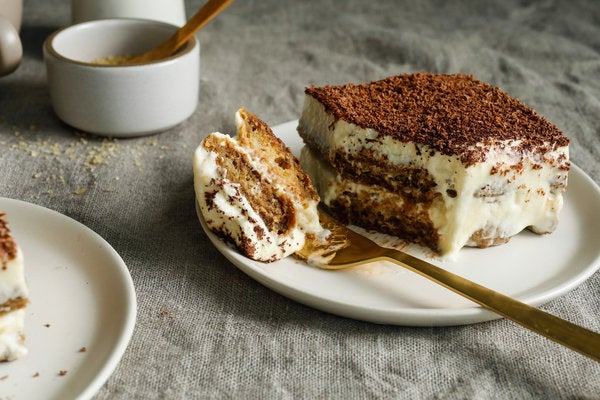

# :cake: Tiramisù

{ loading=lazy }

| :timer_clock: Total Time |
|:-----------------------: |
| 4.00 hours |

## :salt: Ingredients

- :egg: 4 large egg yolks
- :candy: 0.5 cup sugar
- :glass_of_milk: 0.75 cup heavy cream
- :cheese_wedge: 8 oz mascarpone
- :coffee: 1.75 cups espresso or very strong coffee
- :tumbler_glass: 2 Tbsp rum or cognac
- :chocolate_bar: 2 Tbsp cocoa powder
- :baguette_bread: 24 [ladyfinger][1]
- :chocolate_bar: 1.5 oz chocolate (optional)

## :cooking: Cookware

- 1 electric mixer
- 1 large bowl
- 1 medium bowl
- 1 8x8-inch dish or a 9-inch round cake pan

## :pencil: Instructions

### Step 1

Using an electric mixer in a medium bowl, whip together egg yolks and 1/4 cup/50 grams sugar until very pale yellow and
about tripled in volume. A slight ribbon should fall from the beaters (or whisk attachment) when lifted from the bowl.
Transfer mixture to a large bowl, wiping out the medium bowl used to whip the yolks and set aside.

### Step 2

In the medium bowl, whip heavy cream and remaining 1/4 cup/50 grams sugar until it creates soft-medium peaks. Add
mascarpone and continue to whip until it creates a soft, spreadable mixture with medium peaks. Gently fold the
mascarpone mixture into the sweetened egg yolks until combined.

### Step 3

Combine espresso or very strong coffee and rum or cognac in a shallow bowl and set aside.

### Step 4

Using a sifter, dust the bottom of a 2-quart baking dish (an 8x8-inch dish or a 9-inch round cake pan would also work
here) with 1 tablespoon cocoa powder.

### Step 5

Working one at a time, quickly dip each [ladyfinger][1] into the espresso mixture

### Step 6

Dust top layer with remaining tablespoon of cocoa powder. Top with shaved or finely grated chocolate (optional), if
desired.

### Step 7

Cover with plastic wrap and let chill in the refrigerator for at least 4 hours (if you can wait 24 hours, all the
better) before slicing or scooping to serve.

## :link: Source

- <https://cooking.nytimes.com/recipes/1018684-classic-tiramisu>

[1]: <../cookies-and-bars/ladyfingers.md>
