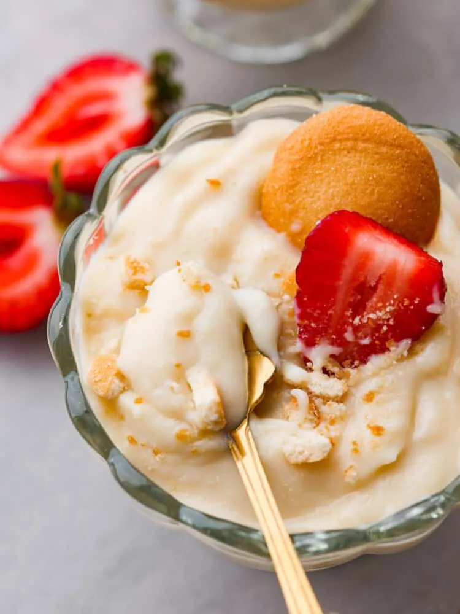

---
tags:

  - desserts
comments: true

hero: assets/images/vanilla-pudding.webp
---

# :icecream: Vanilla Pudding

{ loading=lazy }

| :timer_clock: Total Time |
|:-----------------------: |
| 4.17 hours |

## :salt: Ingredients

- :candy: 0.5 cup (78 g) sugar
- :chestnut: 3 Tbsp (21 g) cornstarch
- :salt: 0.25 tsp salt
- :glass_of_milk: 2.25 cup (511 g) whole milk
- :egg: 2 large egg yolks
- :butter: 2 Tbsp butter
- :flower_playing_cards: 1.5 tsp vanilla
- :apple: some fresh berries (optional)
- :hot_pepper: some [vanilla wafers][1] (optional)

## :cooking: Cookware

- :shallow_pan_of_food: 1 heavy-bottomed medium saucepan
- 1 heat-proof container
- :package: 1 plastic wrap
- 1 serving bowls (optional)

## :pencil: Instructions

### Step 1

Mix the sugar, cornstarch, and salt together in a heavy-bottomed medium saucepan. Whisk in the whole milk and egg yolks.

### Step 2

Heat over medium, whisking constantly until the mixture thickens and bubbles, which takes about 5 to 8 minutes. Once
thickened, continue to cook for an additional 1 to 2 minutes all while still whisking constantly.

### Step 3

Remove from the heat and whisk in the butter and vanilla. Pour into a heat-proof container and press a layer of plastic
wrap to the top of the pudding, making sure the plastic wrap makes contact with all of it in order to prevent a film
forming as it cools.

### Step 4

Chill in the fridge for 4 hours, or overnight.

### Step 5

Before serving, stir the pudding well. Transfer to serving bowls (optional), if desired. Top with toppings of your
choice. I always like serving it with fresh berries (optional) and [vanilla wafers][1] (optional)!

## :link: Source

- <https://therecipecritic.com/homemade-vanilla-pudding/>

[1]: <../cookies-and-bars/vanilla-wafers.md>
