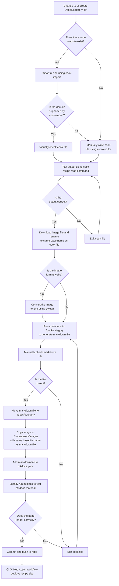

# Development

## :smiley: Emoji

Emoji are manually added to the front of ingredients and cookware to give the pages a little bit of flare. My hopes is
that eventually this can be added to `cook-docs` as an automated task. For now, `emoji.yaml` can be used as reference.

```yaml title="emoji.yaml"
--8<-- "includes/emoji.yaml"
```

## :runner: Workflow

Below is my current workflow for documenting recipes.



## :frame_with_picture: Convert webp to png

```shell title="Installation"
sudo apt install webp
```

```shell title="Convert"
dwebp file.webp -o file.png
```
