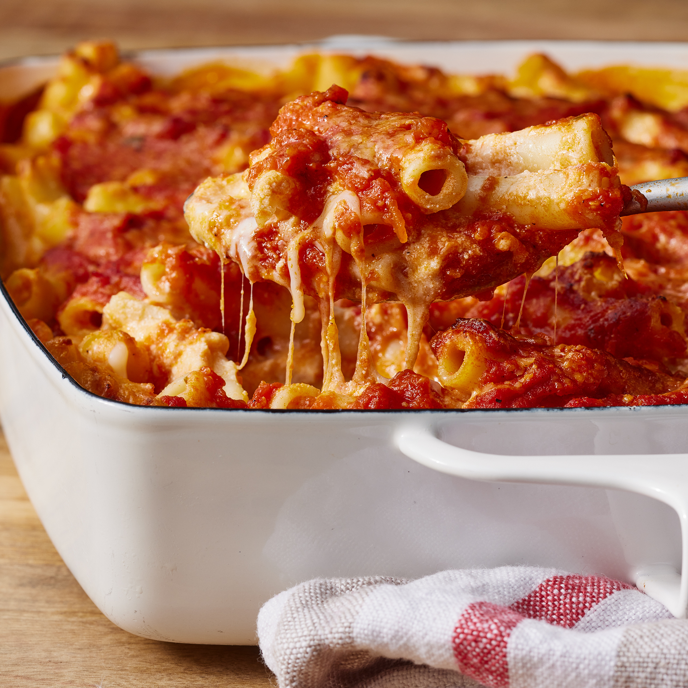

# 🍝 Baked Ziti

| :timer_clock: Total Time |
|:-----------------------: |
| 25 minutes |

## :salt: Ingredients

- :spaghetti: 1 lb [penne pasta][2]
- :spaghetti: 2 16-oz jars [marinara sauce][1]
- :cheese_wedge: 16 oz mozzarella
- :cheese_wedge: 1 16-oz container ricotta
- :cheese_wedge: 1 block Jack cheese

## :cooking: Cookware

- 1 large saucepan
- 1 9 x 13" casserole dish

## :pencil: Instructions

### Step 1

Preheat oven to 375°F.

### Step 2

In a large saucepan, [cook penne pasta][2] until al dente.

### Step 3

in a 9 x 13" casserole dish, pour just enough [marinara sauce][1] to coat the bottom of the dish.

### Step 4

When pasta has cooked, drain and then mix in 1 entire jar of marinara, and mozzarella, ricotta, and Jack cheese,
reserving about 1/2-3/4 cup of mozzarella.

### Step 5

Pour pasta mixture in casserole pan and pour remaining marinara and mozzarella on top.

### Step 6

Bake covered for 10 minutes, then uncovered for 10 to 15 minutes more, or until cheese is brown and bubbly.

[1]: <../sauces-and-dressings/marinara-sauce.md>
[2]: <../reference/equivalents-and-substitutes.md#pasta-water>
