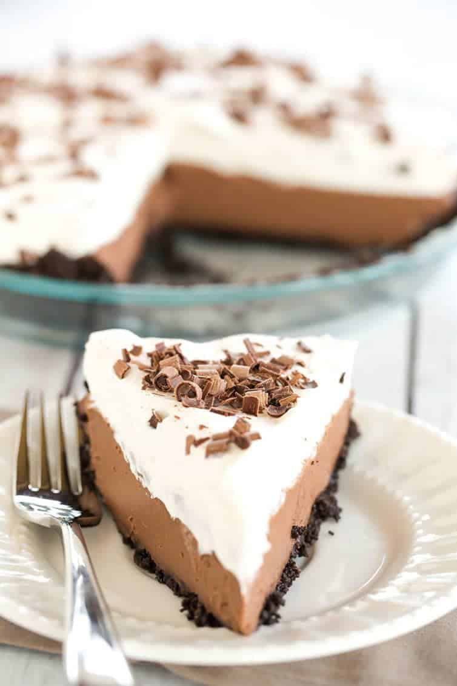

# :pie: Chocolate Mousse Pie with Joe-Joe's Crust

| :timer_clock: Total Time |
|:-----------------------: |
| 4.12 hours |

## :salt: Ingredients

- :cookie: 28 cookies TJ's Joe-Joe's
- :butter: 0.25 cup unsalted butter
- :coconut: 1 14-oz can coconut cream
- :chocolate_bar: 1 12-oz bag semi-sweet chocolate chips
- :salt: 0.5 tsp salt
- :ice_cream: 1 can whipped cream

## :cooking: Cookware

- 1 food
- 1 double boiler

## :pencil: Instructions

### Step 1

Preheat oven to 350°F.

### Step 2

Crush TJ's Joe-Joe's in a food processor until they are fine crumbs. Blend in melted unsalted butter.

### Step 3

Bake 5 to 7 minutes, the remove and cool completely.

### Step 4

Clean the food processor, then pour in coconut cream. Set aside.

### Step 5

Melt semi-sweet chocolate chips in double boiler, then pour into the food processor with the coconut cream. Add salt.
Blend until completely smooth, 20 to 30 seconds.

### Step 6

Pour filling into crust and chill for 4 hours or overnight in the fridge.

### Step 7

Serve with whipped cream.
