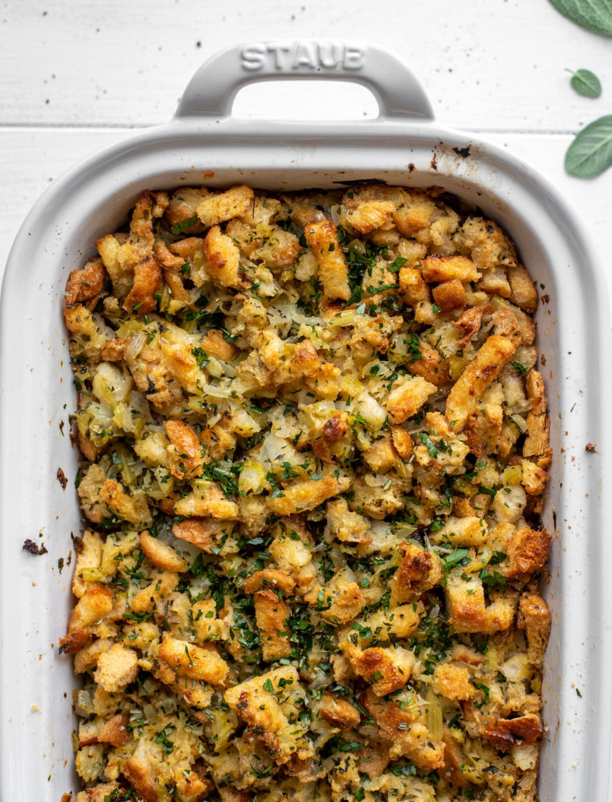

# :stuffed_flatbread: Grandpa's Stuffing

| :timer_clock: Total Time |
|:-----------------------: |
| 40 minutes |

## :salt: Ingredients

- :bread: 0.5 loaf white bread
- :leafy_green: 1 stalk celery
- :onion: 1 yellow onion
- :corn: 1 pkg Albers yellow cornmeal (prepared)
- :droplet: some water
- :poultry_leg: some poultry seasoning
- :butter: 1 stick melted butter

## :cooking: Cookware

- 1 blender
- 1 casserole pan

## :pencil: Instructions

### Step 1

Preheat oven to 350°F.

### Step 2

Blend white bread, celery, and yellow onion in a blender.

### Step 3

Crumble Albers yellow cornmeal (prepared). Add water to the desired the desired texture.

### Step 4

PLace into a casserole pan.

### Step 5

Cover with poultry seasoning to taste.

### Step 6

Add melted butter.

### Step 7

Stir, then cook for 30 to 40 minutes.

## :link: Source

- Grandpa Sims
