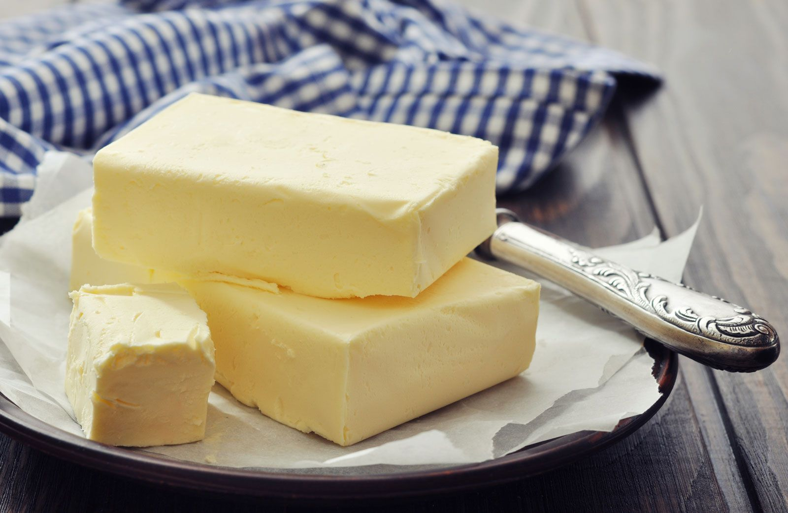

# :butter: Butter

{ loading=lazy }

| :timer_clock: Total Time |
|:-----------------------: |
| 10 minutes |

## :salt: Ingredients

- :icecream: 1 qt 40 percent heavy whipping cream
- :ice_cube: some iced water

## :cooking: Cookware

- 1 stand mixer
- 1 fine mesh bag or cheesecloth or face towel

## :pencil: Instructions

### Step 1

Add 40 percent heavy whipping cream to bowl of stand mixer fitted with the whisk attachment.

### Step 2

Turn mixer on to level 4 or 5 and mix until you get whipped cream.

### Step 3

As the cream gets thicker, increase the mixer speed.

### Step 4

The cream should separate from the milk. The milk is buttermilk.

### Step 5

When the cream gets lumpy and starts to turn yellow, keep whipping until the buttermilk separates from the cream.

### Step 6

Scrape the butter off the walls of the bowl and out of the mixer blades and smush it all together.

### Step 7

Add the butter to a fine mesh bag or cheesecloth or face towel. Rinse the butter in iced water because if you don't
rinse the buttermilk off of the butter, the butter will spoil quickly.

### Step 8

Shape the butter and store it in a container in the fridge.

## :link: Source

- <https://chefjeanpierre.com/recipes/how-to-make-butter/>
