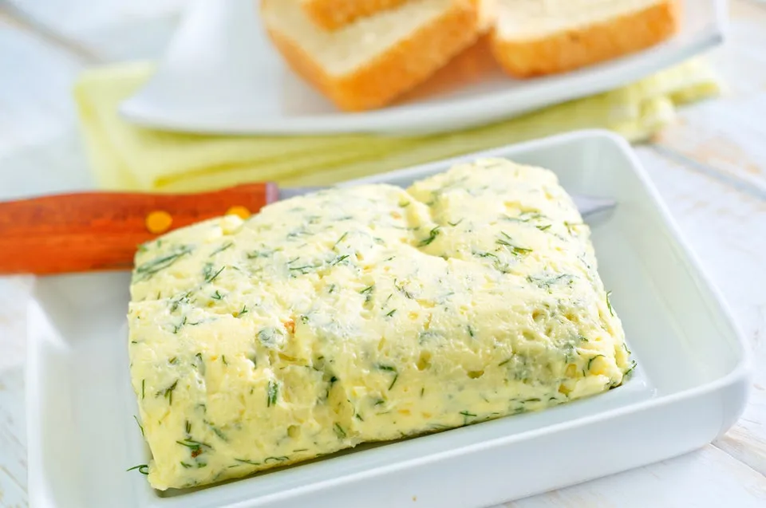

# :butter: Garlic-Parsley Basting Butter

{ loading=lazy }

| :fork_and_knife_with_plate: Serves | :timer_clock: Total Time |
|:----------------------------------:|:-----------------------: |
| 4 | 10 minutes |

## :salt: Ingredients

- :butter: 4 Tbsp (56 g) unsalted butter
- :apple: 1 Tbsp Worcestershire
- :herb: 1 Tbsp parsley
- :garlic: 1 tsp garlic
- :salt: 0.5 tsp pepper

## :cooking: Cookware

- 1 small saucepan

## :pencil: Instructions

### Step 1

Melt unsalted butter in small saucepan over medium heat. Add Worcestershire, parsley, minced garlic, and pepper and
cook, stirring frequently, until mixture is simmering and fragrant, 1 to 2 minutes. Remove from heat. Cover to keep warm
until ready to use.

## :link: Source

- Cook's Illustrated
