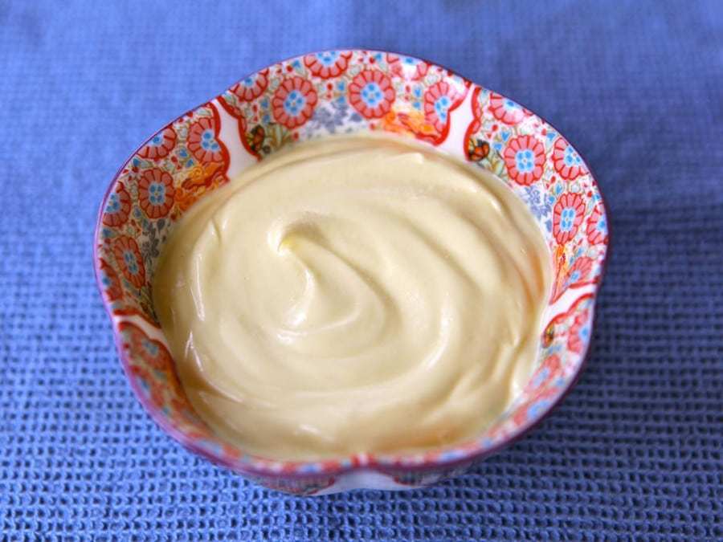

# :butter: Spreadable Butter

{ loading=lazy }

## :scales: Ratio

| :butter: butter | :olive: oil |
|:---------------:|:-----------:|
| 3 parts         | 2 parts     |

| :fork_and_knife_with_plate: Serves | :timer_clock: Total Time |
|:----------------------------------:|:-----------------------: |
| 45 | 2.03 hours |

## :salt: Ingredients

- :butter: 227 g unsalted butter
- :olive: 150 g olive or canola oil
- :salt: 0.25 tsp salt

## :cooking: Cookware

- 1 food processor

## :pencil: Instructions

### Step 1

Let the unsalted butter slowly come to room temperature. To speed this process, cut the butter into small chunks and
separate them from each other. Do not try to speed things up in the microwave, even at half power... you’ll change the
texture of the butter.

### Step 2

Place the room temperature butter into a food processor along with the olive or canola oil and salt.

### Step 3

Process the butter, oil and salt for 1 to 2 minutes, scraping the sides of the processor periodically, till all lumps
have disappeared and the mixture is smooth and soft. It will be quite liquid, but don't worry, it will firm up in the
fridge.

### Step 4

Pour the softened butter into a container that can be sealed airtight (like a Tupperware). Refrigerate for 1 to 2 hours
till fully chilled and firm.

## :link: Source

- <https://toriavey.com/homemade-spreadable-butter/>
