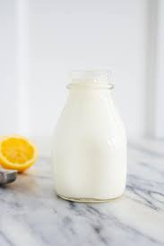

# :glass_of_milk: Buttermilk

{ loading=lazy }

| :timer_clock: Total Time |
|:-----------------------: |
| 15 minutes |

## :salt: Ingredients

- :glass_of_milk: 1 cup [whole milk][1]
- :lemon: 1 Tbsp vinegar or lemon juice

## :pencil: Instructions

### Step 1

Mix 1 cup of whole milk with 1 tablespoon vinegar or lemon juice and let
it sit for 10 to 15 minutes.

!!! note

    The acidity in buttermilk tenderizes the gluten (protein) in flour, plus it works with baking soda better than
    plain milk by both neutralizing the flavor of the soda at the same time it is activating it, providing
    wonderful leavening.

!!! info

    Buttermilk may also be made as a by product of the [butter][2] making process.

## :link: Source

- The King Arthur Baking Company All-Purpose Baker's Companion

[1]: <../reference/equivalents-and-substitutes.md#whole-milk>
[2]: <./butter/butter.md>
