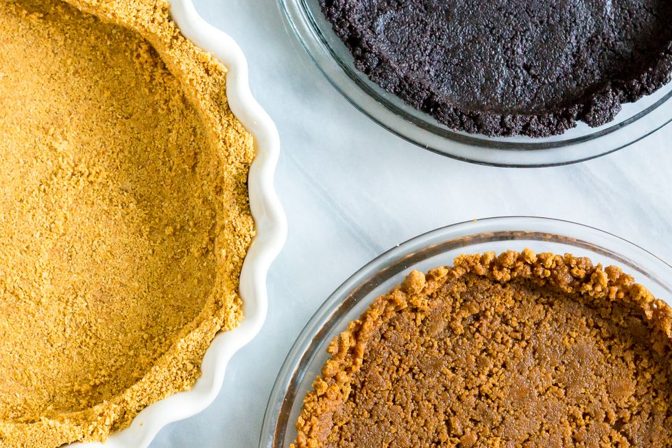

# :pie: Crumb Crust

{ loading=lazy }

| :fork_and_knife_with_plate: Serves | :timer_clock: Total Time |
|:----------------------------------:|:-----------------------: |
| 1 9-in or 10-in piecrust and topping | 30 minutes |

## :salt: Ingredients

- :rice_cracker: 1.5 cup graham cracker
- :icecream: 1.5 cup vanilla or chocolate wafer (alternative)
- :candy: 0.5 cup sugar
- :butter: 6 Tbsp unsalted butter
- :custard: 1 tsp cinnamon (optional)

## :cooking: Cookware

- 1 bowl
- 1 pie pan

## :pencil: Instructions

### Step 1

The flavor of the filling should determine which cracker or cookie to crumble.

### Step 2

Put in a bowl, reserving a tablespoon or two for topping, if desired 1/2 cups fine graham cracker, vanilla or chocolate
wafer (alternative), or gingersnap crumbs.

### Step 3

Add and stir until well blended: 1/4 to 1/2 cup sugar, depending on sweetness of the cookies. 6 tablespoons (3/4 stick)
unsalted butter, melted and cooled, and 1 teaspoon ground cinnamon (optional).

### Step 4

An easy way to shape the crumb crust is to place the crumb mixture in a pie pan, distributing the crumbs fairly evenly,
then press another pie pan of the same diameter firmly into the dough. When the top pan is removed, a crust of even
thickness underneath. Trim any excess that is forced over the top edge, or just pat back into the pan.

### Step 5

Crumb crusts do not need to be baked before filling, but if used unbaked, the crust must first be frozen for 20 minutes,
or the filling will soften it. If baked before filling, they are more crunchy and flavorful; a 350°F oven for 10 to 12
minutes will do the trick. Cool the baked shell before filling.

### Step 6

When the pie is filled, scatter reserved crumbs as a topping.

## :link: Source

- Joy of Cooking
