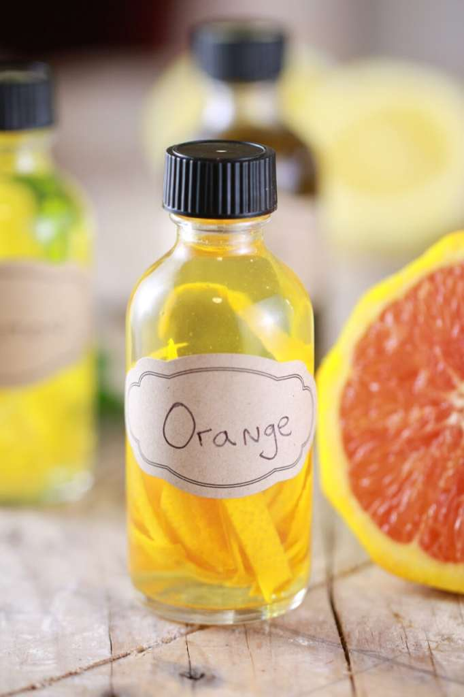

# :orange_circle: Orange Extract

{ loading=lazy }

| :fork_and_knife_with_plate: Serves | :timer_clock: Total Time |
|:----------------------------------:|:-----------------------: |
| 2 oz | 5-6 weeks |

## :salt: Ingredients

- :orange_circle: 1 large navel orange
- :sake: 2 oz vodka

## :cooking: Cookware

- 1 2-fl. oz glass bottle

## :pencil: Instructions

### Step 1

Peel thin strips of zest from 1/2 of your navel orange.

### Step 2

Place zest into your 2-fl. oz glass bottle.

### Step 3

Add vodka, filling up to the neck of the bottle.

### Step 4

Every few days, tilt your bottle upside down to gently mix the liquid inside.

### Step 5

After 5-6 weeks, you have extract! (I think with citrus peels the acid (and alcohol bath), it’s probably safe to leave
the peels inside the bottle like a vanilla bean for re-fill purposes. If you don’t feel comfortable doing this, take
it out!)

## :link: Source

- <https://www.biggerbolderbaking.com/homemade-extracts/>
