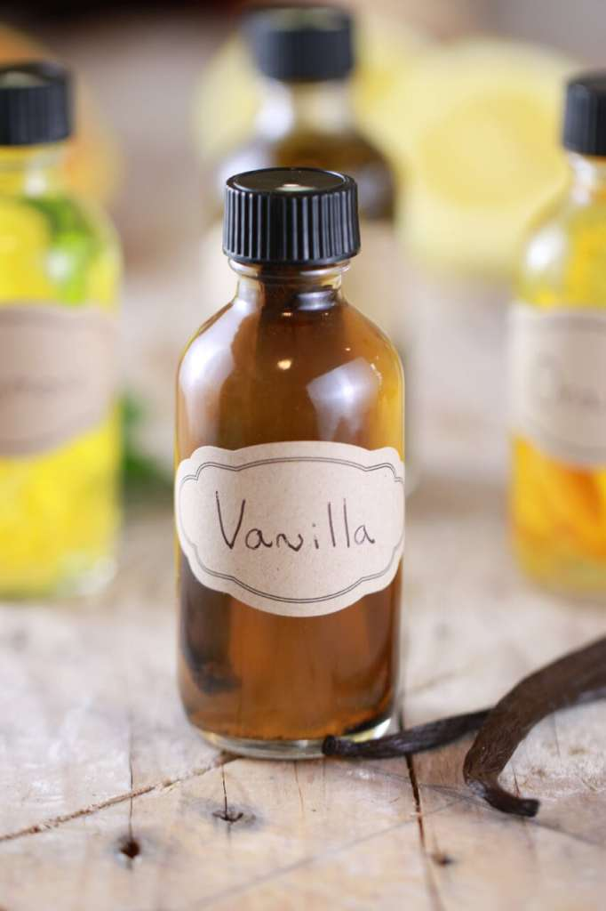

# :icecream: Vanilla Extract

| :timer_clock: Total Time |
|:-----------------------: |
| 5-6 weeks |

## :salt: Ingredients

- :icecream: 3 vanilla beans
- :tumber_glass: 2 oz vodka or bourbon

## :cooking: Cookware

- 1 2-fl. oz glass bottle

## :pencil: Instructions

### Step 1

Cut your vanilla beans in half, then split open each half to expose the vanilla seeds on the inside of the pod.

### Step 2

Place cut vanilla beans inside your 2-fl. oz glass bottle.

### Step 3

Add vodka or bourbon, filling up to the neck of the bottle.

### Step 4

Seal tightly and store bottle in a cool, dry place.

### Step 5

Every few days, tilt your bottle upside down to gently mix the liquid inside.

### Step 6

After 5-6 weeks, you have extract! (If you leave in your vanilla beans, when you start running low, just add more vodka
and wait a little.)

### Step 7

Note: As a guide you use 1 cup/8 ozs of vodka to 4 - 6 vanilla beans, depending on the quality of the beans.

## :link: Source

- <https://www.biggerbolderbaking.com/homemade-extracts/#wprm-recipe-container-18360>
