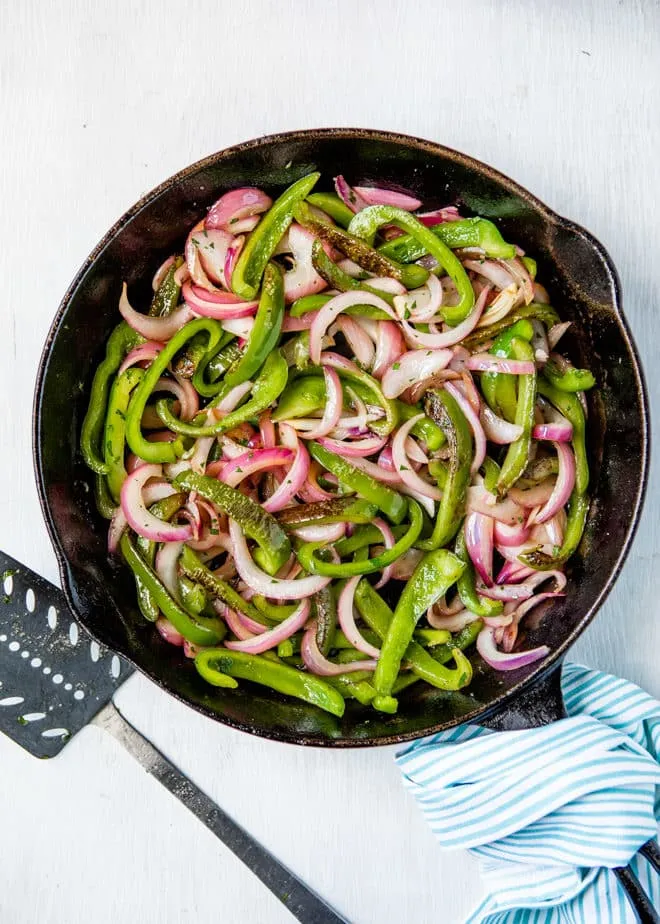

# :bell_pepper: Fajita Veggies

{ loading=lazy }

| :fork_and_knife_with_plate: Serves | :timer_clock: Total Time |
|:----------------------------------:|:-----------------------: |
| 8 | 15 minutes |

## :salt: Ingredients

- :seedling: ::sunflower: 0.25 cup sunflower oil
- :beans: 2 large green peppers
- :tea: 1 large red onions
- :herb: 0.5 tsp oregano
- :salt: 0.5 tsp salt

## :cooking: Cookware

- 1 large skillet

## :pencil: Instructions

### Step 1

In a large skillet over medium-high heat, heat sunflower oil until shimmering. Add green peppers, red onions, oregano,
and salt to taste (I like 1/2 teaspoon).

### Step 2

Cook, tossing occasionally, until slightly softened but still tender-crisp, about 7 minutes. Remove from heat and serve.

## :link: Source

- <https://www.culinaryhill.com/chipotle-grilled-peppers-and-onions/>
