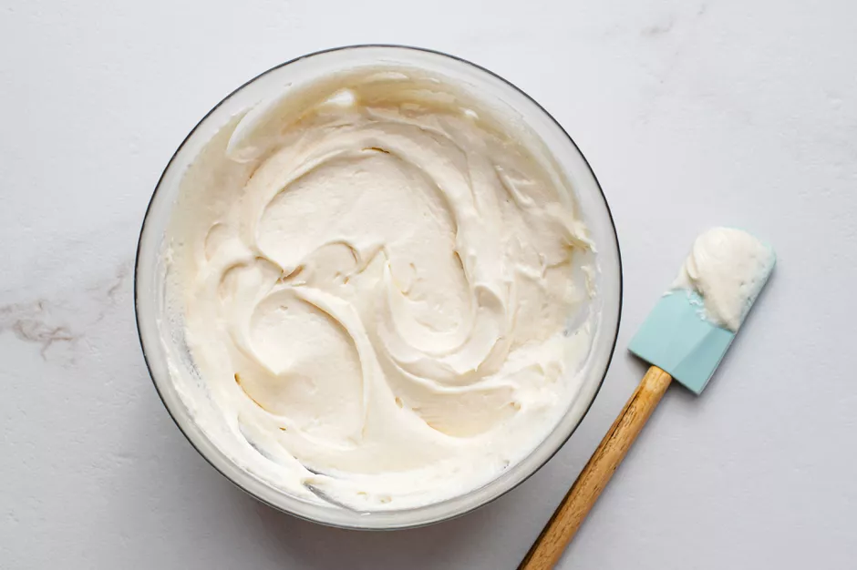

# :birthday: Cream Cheese Frosting

| :fork_and_knife_with_plate: Serves | :timer_clock: Total Time |
|:----------------------------------:|:-----------------------: |
| 2 cups | 0 minutes |

## :salt: Ingredients - Food Processor Method

- :bagel: 8 oz cold cream cheese
- :butter: 6 Tbsp unsalted butter, softened
- :icecream: 2 tsp vanilla
- :candy: 3 cups confectioners' sugar, sifted
- :lemon: some lemon zest (optional)
- :orange_circle: some orange zest (optional)
- :custard: some cinnamon (optional)
- :tumbler_glass: some liqueur (optional)

## :salt: Ingredients - Electric Mixer Method

- :bagel: 8 oz cold cream cheese
- :butter: 5 Tbsp unsalted butter, softened
- :icecream: 2 tsp vanilla
- :candy: 4 cups confectioners' sugar, sifted
- :lemon: some lemon zest (optional)
- :orange_circle: some orange zest (optional)
- :custard: some cinnamon (optional)
- :tumbler_glass: some liqueur (optional)

## :cooking: Cookware

- 1 food processor
- 1 medium bowl

!!! info

    There are two secrets to making perfectly smooth cream cheese frosting with enough body to swirl on a cake or
    pipe through a pastry bag: Do not overbeat, and use cold - not softened - cream cheese. Have the butter, if
    using it, at room temperature, and sift the confectioners' sugar after measuring.

!!! info

    Feel free to vary the amount of confectioners' sugar to suit your taste: we have seen recipes with as little
    as 1 tsp and as much as 1/2 cup sugar per once of cream cheese.

## :pencil: Instructions - Food Processor Method

### Step 1

Combine in a food processor and pulse just until smooth and creamy cold cream cheese, unsalted
butter, softened, vanilla, and confectioners' sugar, sifted.

### Step 2

If the frosting is too stiff, pulse for a few seconds longer, do not overprocess. If desired, stir in additional
flavorings to taste such as lemon zest (optional), orange zest (optional), cinnamon (optional), or liqueur (optional).

## :pencil: Instructions - Electric Mixer Method

### Step 3

Beat in a medium bowl at low speed just until blended cold cream cheese, unsalted butter,
softened, and vanilla.

### Step 4

Add one-third at a time and beat just until smooth and the desired consistency confectioners' sugar, sifted.

### Step 5

If the frosting is too stiff, beat for a few seconds longer; do not overbeat. If desired, stir in additional flavorings
to taste such as lemon zest (optional), orange zest (optional), cinnamon (optional), or liqueur (optional).

## :link: Source

- Joy of Cooking
