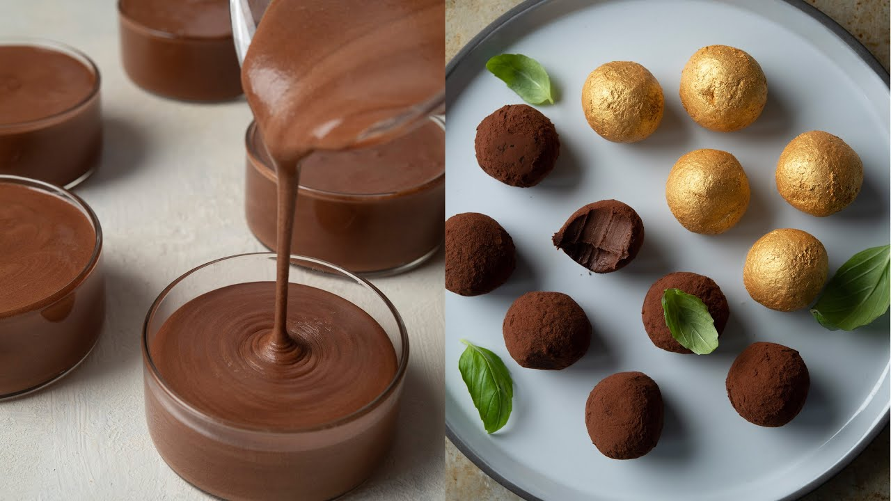

# :chocolate_bar: Dominique Ansel's Chocolate Ganache

| :timer_clock: Total Time |
|:-----------------------: |
| 15 minutes |

## :salt: Ingredients

- :glass_of_milk: 220 g heavy cream
- :glass_of_milk: 45 g whole milk
- :chocolate_bar: 220 g 66 percent cocoa chocolate
- :butter: 45 g unsalted butter

## :cooking: Cookware

- 1 small saucepan
- 1 large bowl

## :pencil: Instructions

### Step 1

Combine the heavy cream and the whole milk in a small saucepan and bring to a boil over medium heat. Remove from the
heat.

### Step 2

Place the 66 percent cocoa chocolate in a large bowl. Slowly pour the hot cream mixture over the chocolate in two
additions and stir until the chocolate has melted and the mixture is smooth. You’re mixing to melt the chocolate here,
not to incorporate air, so stop mixing when all the chocolate has melted.

### Step 3

Add the unsalted butter and stir until fully incorporated. Let cool completely. Adding butter softens the ganache and
makes it smoother.

Best For:

1. Filling tarts and light cakes—this is a rich filling, so I usually recommend a thin slice of chocolate ganache tart.
2. Glazing (i.e., finishing) mousse cakes when the ganache is still warm and liquid.
3. Truffles ganache rolled and finished with unsweetened cocoa powder.

## :link: Source

- <https://www.youtube.com/watch?v=fsYvgNcii7c>
