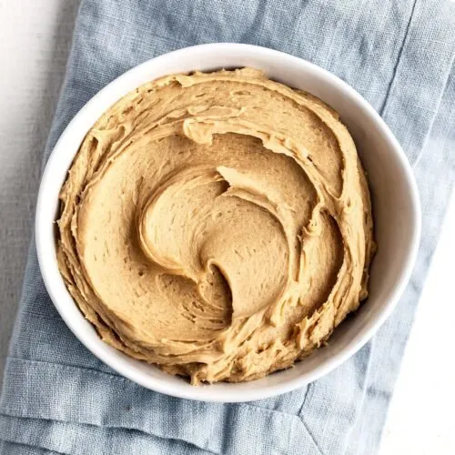

# :peanuts: Peanut Butter Frosting

{ loading=lazy }

| :fork_and_knife_with_plate: Serves | :timer_clock: Total Time |
|:----------------------------------:|:-----------------------: |
| 2 cups | 10 minutes |

## :salt: Ingredients

- :peanut: 0.5 cup (135 g) [smooth peanut butter][1]
- :cheese_wedge: 3 oz (85 g) cold cream cheese
- :baby_bottle: 1.5 Tbsp (21 g) unsalted butter, softened
- :flower_playing_cards: 1 tsp vanilla
- :glass_of_milk: 3 Tbsp (43 g) cream or milk
- :apple: 2 Tbsp bourbon or rum (optional)
- :baby_bottle: 2.66 cups (301 g) confectioners' sugar, sifted
- :baby_bottle: 2 Tbsp (14 g) cream, milk, or liquor or as needed

## :cooking: Cookware

- 1 medium bowl

## :pencil: Instructions

!!! note

    Stir in chopped peanuts to taste, or sprinkle them over the finished cake, if desired. Try this as a filling for
    any cake frosted or glazed with chocolate. Have the cream cheese cold. The butter can be cold, but it's better to
    have it at room temperature.

### Step 1

Beat in a medium bowl just until blended [smooth peanut butter][1], cold cream cheese, unsalted butter, softened,
vanilla, cream or milk, and bourbon or rum (optional).

### Step 2

Add one-third at a time and beat just until smooth and the desired consistency is reached confectioners' sugar, sifted.

### Step 3

If the frosting is too stiff, add, but do not overbeat cream, milk, or liquor or as needed.

## :link: Source

- Joy of Cooking

[1]: <../../ingredients/peanut-butter.md>
