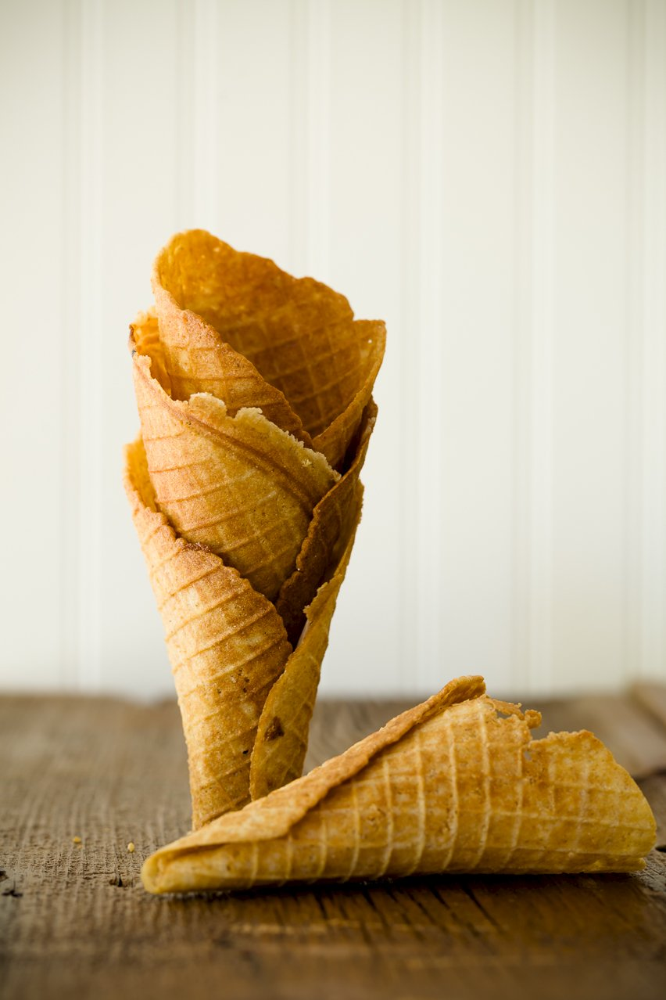

# :icecream: Ice Cream Cones

{ loading=lazy }

| :fork_and_knife_with_plate: Serves | :timer_clock: Total Time |
|:----------------------------------:|:-----------------------: |
| 6 | 3 minutes |

## :salt: Ingredients

- :egg: 2 large egg whites
- :salt: 1 pinch salt
- :candy: 95 g confectioners' sugar
- :icecream: 0.25 tsp vanilla
- :ear_of_rice: 65 g all-purpose flour
- :butter: 55 g unsalted butter

## :cooking: Cookware

- 1 stand mixer
- 1 spatula
- 1 waffle cone maker
- 1 cone roller

## :pencil: Instructions

### Step 1

In the bowl of stand mixer fitted with the whisk attachment, whisk the egg whites until soft peaks form. Add the salt
and 1 tablespoon of the confectioners' sugar then whisk until stiff peaks form.

### Step 2

Using a spatula, gently fold in vanilla extract and the remaining sugar, then fold in the all-purpose flour and melted
unsalted butter, until smooth.

### Step 3

Heat a waffle cone maker according to manufacturer’s instructions. Spray the cooking plates with oil. Place a heaped
tablespoon of the batter in the center of the cooking plate and close the lid.

### Step 4

Cook for 2 to 3 minutes until dark golden. While the waffle is warm, carefully roll it around the cone roller to form a
cone shape, then leave to cool. Repeat with the remaining batter to make 6 cones.

## :link: Source

- <https://thegreatbritishbakeoff.co.uk/recipes/all/prue-leith-pistachio-praline-ice-cream/>
