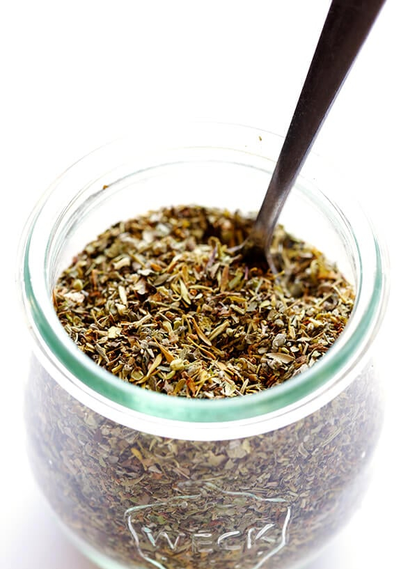

# :herb: Italian Seasoning

| :fork_and_knife_with_plate: Serves | :timer_clock: Total Time |
|:----------------------------------:|:-----------------------: |
| 4 tsp | 5 minutes |

## :salt: Ingredients

- :herb: 1.5 tsp dried oregano
- :herb: 1 tsp dried marjoram
- :herb: 1 tsp dried thyme
- :herb: 0.5 tsp dried basil
- :herb: 0.5 tsp dried rosemary
- :herb: 0.5 tsp dried sage

## :pencil: Instructions

### Step 1

Whisk dried oregano, dried marjoram, dried thyme, dried basil, dried rosemary, and dried sage together in a bowl until
combined. Use immediately or store in a sealed container.

## :link: Source

- <https://www.gimmesomeoven.com/italian-seasoning-recipe/>
