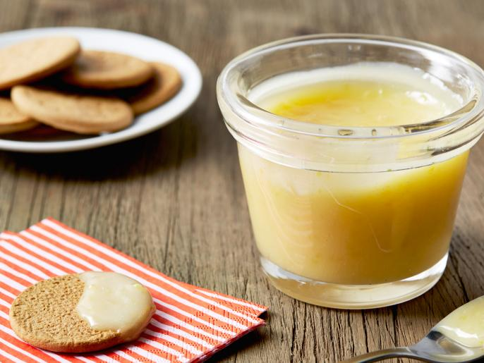

# :lemon: Lemon Curd

| :timer_clock: Total Time |
|:-----------------------: |
| 30 minutes |

## :salt: Ingredients

- :lemon: 3 lemons
- :candy: 1.5 cup sugar
- :butter: 0.25 lb butter
- :egg: 4 eggs
- :lemon: 0.5 cup lemon juice
- :salt: 0.13 tsp salt

## :cooking: Cookware

- 1 peeler
- 1 food processor
- 1 2 quart saucepan, double boiler, or bain-marie
- 1 fine mesh sieve

## :pencil: Instructions

### Step 1

Using a carrot peeler, remove the zest of 3 lemons, being careful to avoid the white pith. Put the zest in a food
processor fitted with the steel blade. Add the sugar and pulse until the zest is very finely minced into the sugar.

### Step 2

Cream the room temperature butter and beat in the sugar and lemon mixture. Add the eggs, 1 at a time, and then add the
lemon juice and salt. Mix until combined.

### Step 3

Pour the mixture into a 2 quart saucepan, double boiler, or bain-marie and cook over low heat until thickened (about 10
minutes), stirring constantly. The lemon curd will thicken at about 170°F, or just below simmer. Remove from the heat
and pass through a fine mesh sieve and cool or refrigerate.

!!! tip

    It is best to sieve the mixture while it is still hot.

## :link: Source

- <https://www.foodnetwork.com/recipes/ina-garten/lemon-curd-recipe-1941910>
