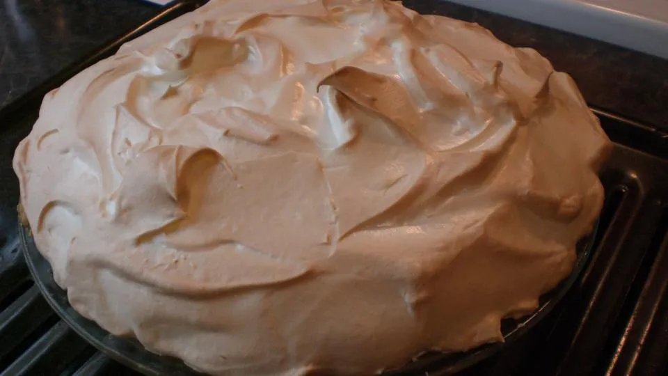

# :egg: French Meringue

{ loading=lazy }

| :fork_and_knife_with_plate: Serves | :timer_clock: Total Time |
|:----------------------------------:|:-----------------------: |
| 9-in pie | 15 minutes |

## :salt: Ingredients

- :beans: 2 egg whites
- :glass_of_milk: 0.25 tsp (1 g) cream of tartar
- :candy: 3 Tbsp (29 g) sugar
- :candy: 4 Tbsp (28 g) confectioners' sugar (alternative)
- :flower_playing_cards: 0.5 tsp vanilla

## :pencil: Instructions

### Step 1

Preheat oven to 325°F to 350°F.

### Step 2

Whip until frothy 2 egg whites

### Step 3

Add 1/4 teaspoon cream of tartar

### Step 4

Whip them until they are stiff, but not dry; until they stand in peaks that lean over slightly when the beater is
removed. Beat in, 1 tablespoon at a time 3 tablespoons sugar or 4 tablespoons confectioners' sugar (alternative).

### Step 5

Do not overheat. Beat in 1/2 teaspoon vanilla

### Step 6

Spread on pie and bake 10 to 15 minutes, depending on the thickness of the meringue.

## :link: Source

- Joy of Cooking
