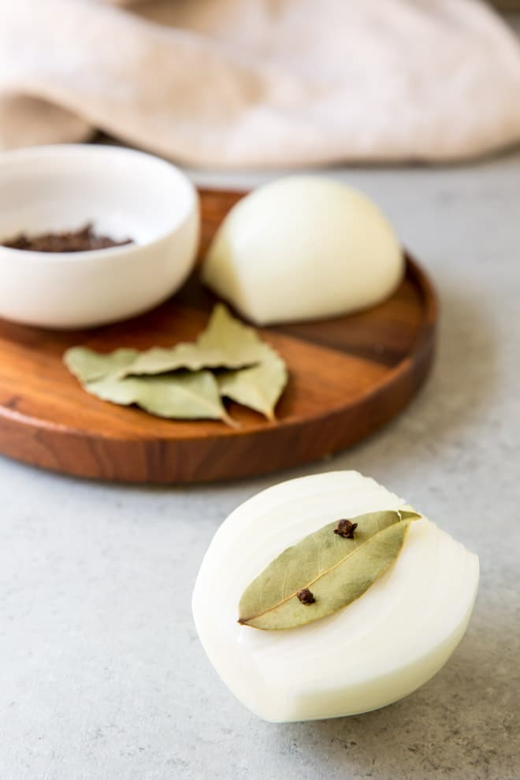

# :onion: Onion Pique

| :timer_clock: Total Time |
|:-----------------------: |
| 5 minutes |

## :salt: Ingredients

- :onion: 0.5 onion
- :fallen_leaf: 1 bay leaf
- :four_leaf_clover: 2 whole dried cloves

## :pencil: Instructions

### Step 1

Trim off the root end of half a peeled onion.

### Step 2

Attach a bay leaf to the cut-side of the onion using 2 or 3 whole dried cloves as pins.

### Step 3

Add to a pot of stock or milk to cook. Remove, squeeze out the liquid, and discard when the stock or milk is finished.

## :zap: Onion Clouté

Leave out the bay leaf and just spike your onion with cloves.

## :link: Source

- <https://www.culinaryhill.com/how-to-make-an-onion-pique/>
