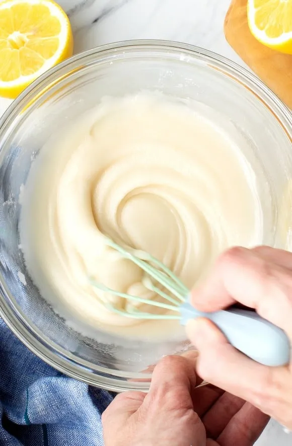

# :glass_of_milk: Milk Glaze

{ loading=lazy }

| :timer_clock: Total Time |
|:-----------------------: |
| 10 minutes |

## :salt: Ingredients

- :baby_bottle: 0.5 cup (56 g) confectioners' sugar, sifted
- :droplet: 2 tsp (9 g) hot milk
- :flower_playing_cards: 0.25 tsp vanilla

## :cooking: Cookware

## :pencil: Instructions

### Step 1

This can be used as a substitute for fondant on small cakes such as petits fours.

### Step 2

Beat together until smooth confectioners' sugar, sifted, hot milk, and vanilla.

## :link: Source

- Joy of Cooking
