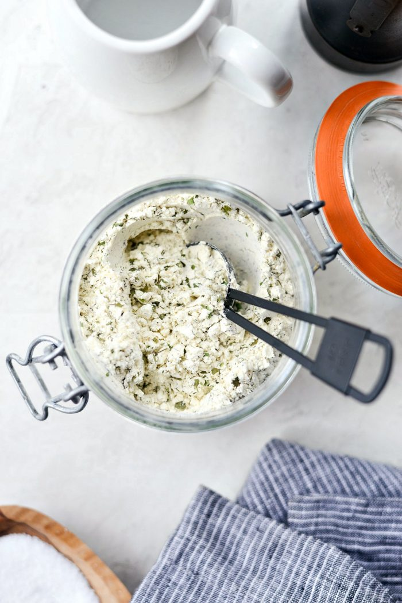

# Ranch Dressing Mix

| :timer_clock: Total Time |
|:-----------------------: |
| 5 minutes |

## :salt: Ingredients

- 1 cup dry buttermilk
- 2.5 Tbsp dried parsley
- 2 Tbsp dried chives
- 2 tsp dried dill
- 2.5 tsp garlic powder
- 1.5 tsp onion powder
- 1.5 tsp dried onion flakes
- 2 tsp salt
- 0.5 tsp black pepper
- 0.5 tsp paprika
- 0.25 tsp cayenne

## :cooking: Cookware

- 1 mixing bowl

## :pencil: Instructions

!!! note
    2 tablespoons of the ranch mix is equivalent to one packet.

### Step 1

In a mixing bowl; measure and add in the dry buttermilk with dried parsley dried chives, dried dill, garlic powder,
onion powder, dried onion flakes, salt, black pepper, paprika, and cayenne whisking to combine.

### Step 2

Transfer the ranch mix into a jar or container that has a tight-fitting lid.

### Step 3

Store in the fridge for up to 12 months.

## :link: Source

- <https://www.simplyscratch.com/homemade-ranch-dressing-mix/>
