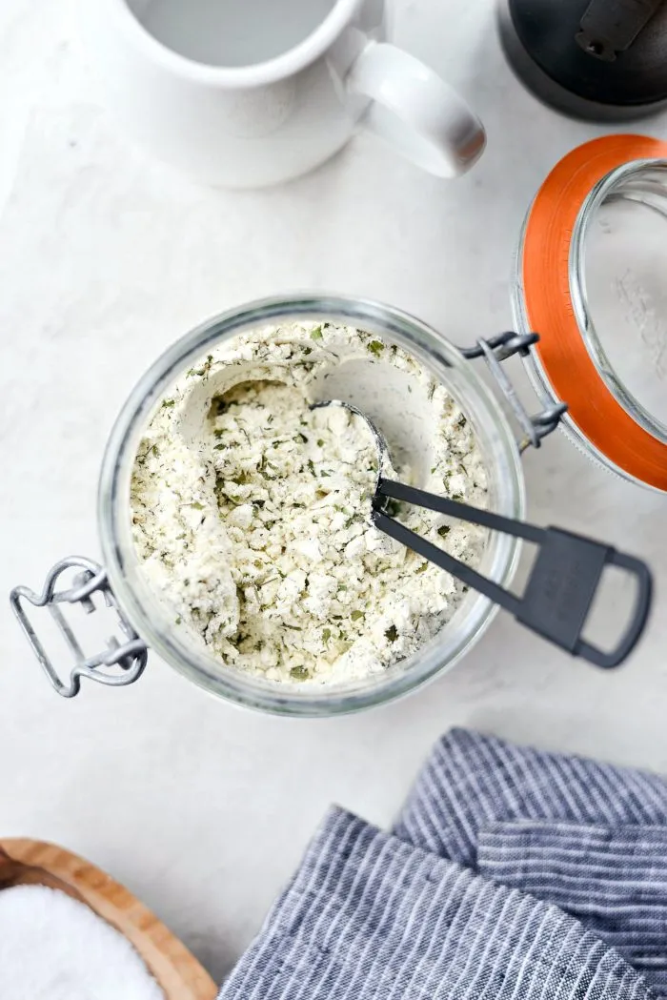

# :butter: Ranch Dressing Mix

{ loading=lazy }

| :timer_clock: Total Time |
|:-----------------------: |
| 5 minutes |

## :salt: Ingredients

- :candy: 1 cup (170 g) dry [buttermilk](buttermilk.md)
- :herb: 2.5 Tbsp (22 g) dried parsley
- :apple: 2 Tbsp (5 g) dried chives
- :herb: 2 tsp (6 g) dried dill
- :garlic: 2.5 tsp garlic powder
- :chestnut: 1.5 tsp (3 g) onion powder
- :tea: 1.5 tsp (3 g) dried onion flakes
- :salt: 2 tsp salt
- :salt: 0.5 tsp (2 g) black pepper
- :candy: 0.5 tsp paprika
- :hot_pepper: 0.25 tsp cayenne

## :cooking: Cookware

- :bowl_with_spoon: 1 mixing bowl

## :pencil: Instructions

!!! note

    2 tablespoons of the ranch mix is equivalent to one packet.

### Step 1

In a mixing bowl; measure and add in the dry [buttermilk](buttermilk.md) with dried parsley dried chives, dried dill, garlic powder,
onion powder, dried onion flakes, salt, black pepper, paprika, and cayenne whisking to combine.

### Step 2

Transfer the ranch mix into a jar or container that has a tight-fitting lid.

### Step 3

Store in the fridge for up to 12 months.

## :link: Source

- <https://www.simplyscratch.com/homemade-ranch-dressing-mix/>
