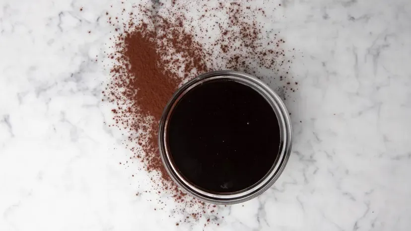

# :maple_leaf: Simple Syrup

{ loading=lazy }

| :fork_and_knife_with_plate: Serves | :timer_clock: Total Time |
|:----------------------------------:|:-----------------------: |
| 500 g | 15 minutes |

## :scales: Ratio

| :candy: Sugar | :droplet: Water | :tumbler_glass: Alcohol |
|---------------|-----------------|-------------------------|
| 10 parts      | 10 parts        | 1 part                  |

## :salt: Ingredients

- :candy: 250 g granulated sugar
- :droplet: 250 g water
- :leafy_green: 25 g alcohol (optional)

## :cooking: Cookware

- 1 pot

## :pencil: Instructions

### Step 1

In a pot, bring granulated sugar and water to a boil while stirring occasionally. Remove from heat and stir in alcohol
(optional) such as dark rum. Let cool to room temperature.

!!! tip

    This is known as a simple syrup, which is a sugar syrup made with a 1:1 ratio of sugar to water.

## :link: Source

- Dominique Ansel
