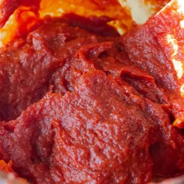

# :tomato: Tomato Paste

| :timer_clock: Total Time |
|:-----------------------: |
| 3 hours 15 minutes |

## :salt: Ingredients

- :tomato: 8 lbs roma tomatoes
- :olive: 2 Tbsp olive oil
- :fallen_leaf: 4 bay leaf

## :cooking: Cookware

- 1 food mill
- 1 4 ounce canning jars

## :pencil: Instructions

### Step 1

Wash and chop your roma tomatoes.

### Step 2

In a hot pan drizzle a little bit of olive oil. I did about a tablespoon

### Step 3

Add your tomatoes and cook until soft.

### Step 4

Pass the soft tomatoes through a food mill.

### Step 5

Once you have a tomato pulp and puree, return it to the stove and add 1 bay leaf per 2 pounds of tomatoes.

### Step 6

Cook on medium high to big heat to reduce the tomatoes down to the above consistency. Be sure to stir and scrape down
the edges and the bottom of the pot. The longer the tomatoes reduce into paste, the lower you should turn down the
temperature.

### Step 7

Portion into 4 ounce canning jars and water bath can or freeze in ice cube trays.

## :link: Source

- <https://www.savoringthegood.com/how-to-make-home-made-tomato-paste/>
