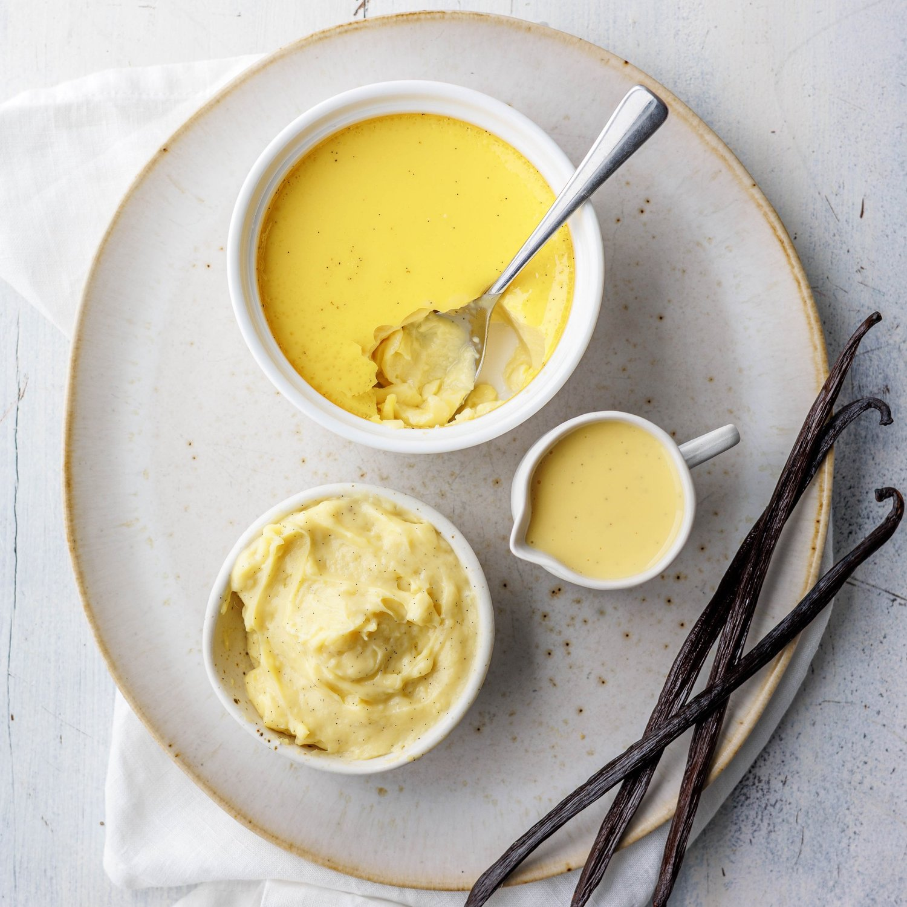

# :icecream: Vanilla Bean Cream

{ loading=lazy }

| :fork_and_knife_with_plate: Serves | :timer_clock: Total Time |
|:----------------------------------:|:-----------------------: |
| 2 cups | 20 minutes |

## :scales: Ratios

| :glass_of_milk: cream | :glass_of_milk: cream | :icecream: vanilla bean |
|:---------------------:|:---------------------:|:-----------------------:|
| 4 cups                | 908 g                 | 2 beans                 |
| 3 cups                | 681 g                 | 1.5 beans               |
| 2 cups                | 454 g                 | 1 bean                  |
| 1 cup                 | 227 g                 | 1/2 bean                |
| 1/2 cup               | 114 g                 | 1/4 bean                |

## :salt: Ingredients

- :glass_of_milk: 2 cups heavy cream
- :icecream: 1 vanilla bean

## :cooking: Cookware

- 1 saucepan
- 1 sieve

## :pencil: Instructions

### Step 1

Scrape the seeds from the vanilla bean.

### Step 2

Heat heavy cream and vanilla bean, with seeds, in a saucepan over very low heat until cream is just bubbling.

### Step 3

Remove pan from heat; steep for about 20 minutes.

### Step 4

Use a sieve to strain the cream and serve warm.

## :link: Source

- <https://www.marthastewart.com/1150987/vanilla-bean-cream>
