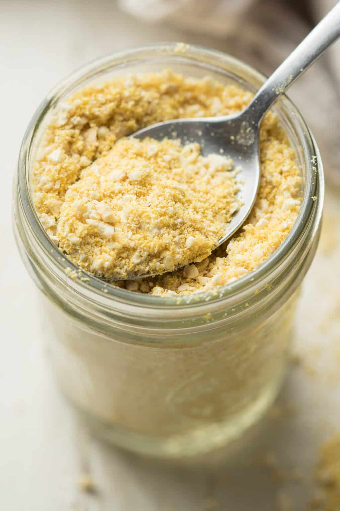

# :cheese_wedge: Vegan Parmesan

{ loading=lazy }

| :timer_clock: Total Time |
|:-----------------------: |
| 5 minutes |

## :salt: Ingredients

- :chestnut: 0.75 cup raw cashew
- :microbe: 3 Tbsp nutritional yeast
- :salt: 0.75 tsp sea salt
- :garlic: 1 dash garlic powder
- :onion: 1 dash onion powder (optional)

## :cooking: Cookware

- 1 food processor

## :pencil: Instructions

### Step 1

Add raw cashew pieces, nutritional yeast, sea salt, garlic powder, and onion powder (optional) to a food
processor. Pulse to a fine meal, stopping to scrape down the sides of the bowl as necessary. Set aside. (This recipe
will yield enough "cheese" to sprinkle on salads, pasta dishes, omelettes...store the leftovers in an airtight container
in the fridge and it will keep for a couple of weeks.)

## :link: Source

- <https://www.traderjoes.com/home/recipes/vegan-caesar-salad>
